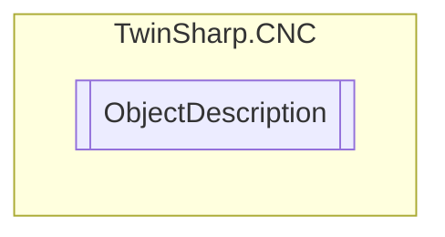

# ObjectDescription `Public class`

## Diagram


## Members
### Methods
#### Public  methods
| Returns | Name |
| --- | --- |
| `string` | [`ToString`](#tostring)() |

## Details
### Constructors
#### ObjectDescription
[*Source code*](https://github.com///blob//TwinSharp/CNC/CNC.cs#L110)
```csharp
public ObjectDescription(byte[] bytes)
```
##### Arguments
| Type | Name | Description |
| --- | --- | --- |
| `byte``[]` | bytes |   |

### Methods
#### ToString
[*Source code*](https://github.com///blob//TwinSharp/CNC/CNC.cs#L129)
```csharp
public override string ToString()
```

*Generated with* [*ModularDoc*](https://github.com/hailstorm75/ModularDoc)
