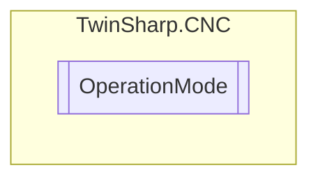

# OperationMode `Public enum`

## Diagram

## Details
### Fields
#### STANDBY_MODE

#### AUTOMATIC_MODE

#### MDI_MODE

#### MANUAL_MODE

#### REFERENCE_MODE

*Generated with* [*ModularDoc*](https://github.com/hailstorm75/ModularDoc)
