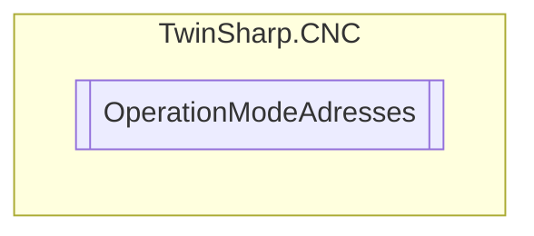

# OperationModeAdresses `Public class`

## Diagram


## Members
### Properties
#### Public  properties
| Type | Name | Methods |
| --- | --- | --- |
| `uint` | [`GeoIndexGroup`](#geoindexgroup) | `get` |
| `uint` | [`OperationModeActual`](#operationmodeactual) | `get` |
| `uint` | [`OperationStateActual`](#operationstateactual) | `get` |

## Details
### Constructors
#### OperationModeAdresses
[*Source code*](https://github.com///blob//TwinSharp/CNC/CncChannel.cs#L324)
```csharp
internal OperationModeAdresses(uint geoIndexGroup)
```
##### Arguments
| Type | Name | Description |
| --- | --- | --- |
| `uint` | geoIndexGroup |   |

### Properties
#### GeoIndexGroup
```csharp
public uint GeoIndexGroup { get; }
```

#### OperationStateActual
```csharp
public uint OperationStateActual { get; }
```

#### OperationModeActual
```csharp
public uint OperationModeActual { get; }
```

*Generated with* [*ModularDoc*](https://github.com/hailstorm75/ModularDoc)
