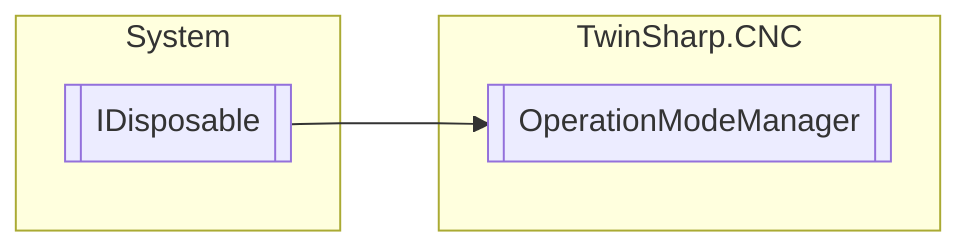

# OperationModeManager `Public class`

## Diagram


## Members
### Properties
#### Public  properties
| Type | Name | Methods |
| --- | --- | --- |
| `bool` | [`InterfaceExists`](#interfaceexists) | `set` |
| [`OperationMode`](./OperationMode.md) | [`OperationModeActual`](#operationmodeactual) | `get` |
| [`HLI_IMCM_MODE_STATE`](./HLI_IMCM_MODE_STATE.md) | [`OperationModeAndStateActual`](#operationmodeandstateactual) | `get` |
| [`OperationState`](./OperationState.md) | [`OperationStateActual`](#operationstateactual) | `get` |
| [`HLI_PROC_TRANS_TO_MODE_STATE`](./HLI_PROC_TRANS_TO_MODE_STATE.md) | [`RequestedModeAndState`](#requestedmodeandstate) | `get` |

### Methods
#### Public  methods
| Returns | Name |
| --- | --- |
| `void` | [`Dispose`](#dispose)() |
| `void` | [`Reset`](#reset)() |
| `void` | [`SetModeAndState`](#setmodeandstate-12)(`...`) |

## Details
### Inheritance
 - `IDisposable`

### Constructors
#### OperationModeManager
[*Source code*](https://github.com///blob//TwinSharp/CNC/OperationModeManager.cs#L16)
```csharp
internal OperationModeManager(AdsClient plcClient, AdsClient geoClient, AdsClient comClient, int channelNumber)
```
##### Arguments
| Type | Name | Description |
| --- | --- | --- |
| `AdsClient` | plcClient |   |
| `AdsClient` | geoClient |   |
| `AdsClient` | comClient |   |
| `int` | channelNumber |   |

### Methods
#### SetModeAndState [1/2]
[*Source code*](https://github.com///blob//TwinSharp/CNC/OperationModeManager.cs#L40)
```csharp
public void SetModeAndState(OperationMode mode, OperationState state, string parameter)
```
##### Arguments
| Type | Name | Description |
| --- | --- | --- |
| [`OperationMode`](./OperationMode.md) | mode |  |
| [`OperationState`](./OperationState.md) | state |  |
| `string` | parameter | It may be necessary to specify parameters when commanding an operation mode change to ensure the successful change to a specific state of an operation mode. |

##### Summary


#### SetModeAndState [2/2]
[*Source code*](https://github.com///blob//TwinSharp/CNC/OperationModeManager.cs#L52)
```csharp
public void SetModeAndState(HLI_PROC_TRANS_TO_MODE_STATE unit)
```
##### Arguments
| Type | Name | Description |
| --- | --- | --- |
| [`HLI_PROC_TRANS_TO_MODE_STATE`](./HLI_PROC_TRANS_TO_MODE_STATE.md) | unit |   |

#### Reset
[*Source code*](https://github.com///blob//TwinSharp/CNC/OperationModeManager.cs#L114)
```csharp
public void Reset()
```

#### Dispose
[*Source code*](https://github.com///blob//TwinSharp/CNC/OperationModeManager.cs#L129)
```csharp
public virtual void Dispose()
```

### Properties
#### RequestedModeAndState
```csharp
public HLI_PROC_TRANS_TO_MODE_STATE RequestedModeAndState { get; }
```

#### OperationModeAndStateActual
```csharp
public HLI_IMCM_MODE_STATE OperationModeAndStateActual { get; }
```

#### OperationStateActual
```csharp
public OperationState OperationStateActual { get; }
```

#### OperationModeActual
```csharp
public OperationMode OperationModeActual { get; }
```

#### InterfaceExists
```csharp
public bool InterfaceExists { set; }
```

*Generated with* [*ModularDoc*](https://github.com/hailstorm75/ModularDoc)
