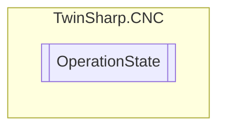

# OperationState `Public enum`

## Diagram

## Details
### Fields
#### NoSignificance

#### PROCESS_DESELECTED

#### PROCESS_SELECTED

#### PROCESS_READY

#### PROCESS_ACTIVE

#### PROCESS_HOLD

#### PROCESS_ERROR

*Generated with* [*ModularDoc*](https://github.com/hailstorm75/ModularDoc)
