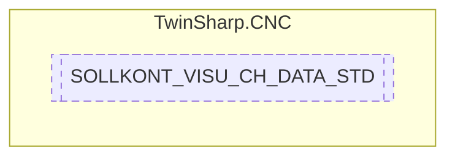

# SOLLKONT_VISU_CH_DATA_STD `Public struct`

## Diagram

```mermaid
  flowchart LR
  classDef interfaceStyle stroke-dasharray: 5 5;
  classDef abstractStyle stroke-width:4px
  subgraph TwinSharp.CNC
  TwinSharp.CNC.SOLLKONT_VISU_CH_DATA_STD[[SOLLKONT_VISU_CH_DATA_STD]]
  class TwinSharp.CNC.SOLLKONT_VISU_CH_DATA_STD interfaceStyle;
  end
```

*Generated with* [*ModularDoc*](https://github.com/hailstorm75/ModularDoc)
