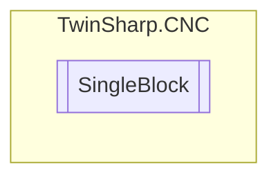

# SingleBlock `Public class`

## Diagram


## Members
### Properties
#### Public  properties
| Type | Name | Methods |
| --- | --- | --- |
| `bool` | [`Enabled`](#enabled) | `get, set` |

## Details
### Constructors
#### SingleBlock
[*Source code*](https://github.com///blob//TwinSharp/CNC/SingleBlock.cs#L9)
```csharp
public SingleBlock(AdsClient comClient, int channelNumber)
```
##### Arguments
| Type | Name | Description |
| --- | --- | --- |
| `AdsClient` | comClient |   |
| `int` | channelNumber |   |

### Properties
#### Enabled
```csharp
public bool Enabled { get; set; }
```

*Generated with* [*ModularDoc*](https://github.com/hailstorm75/ModularDoc)
