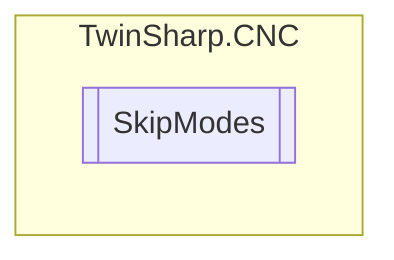

# SkipModes `Public enum`

## Diagram

## Details
### Fields
#### Off

#### SkipLevel1

#### SkipLevel2

#### SkipLevel3

#### SkipLevel4

#### SkipLevel5

#### SkipLevel6

#### SkipLevel7

#### SkipLevel8

#### SkipLevel9

#### SkipLevel10

*Generated with* [*ModularDoc*](https://github.com/hailstorm75/ModularDoc)
