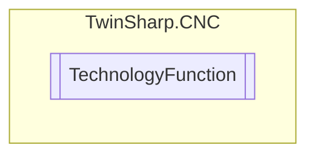

# TechnologyFunction `Public enum`

## Diagram

## Details
### Fields
#### HLI_INTF_M_FKT

#### HLI_INTF_H_FKT

#### HLI_INTF_SPINDEL

#### HLI_INTF_TOOL

*Generated with* [*ModularDoc*](https://github.com/hailstorm75/ModularDoc)
