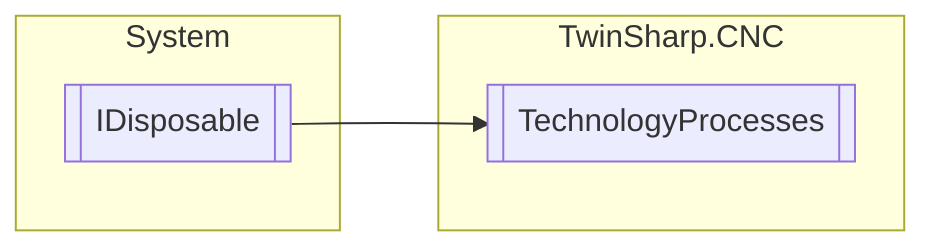

# TechnologyProcesses `Public class`

## Diagram


## Members
### Properties
#### Public  properties
| Type | Name | Methods |
| --- | --- | --- |
| `ushort` | [`CountToBeAcknowledgedInThisBlock`](#counttobeacknowledgedinthisblock)<br>Number of entries in the array ATechnoUnitChannel_Std ( = number of technology functions to be acknowledged in this block) | `get` |

### Methods
#### Public  methods
| Returns | Name |
| --- | --- |
| `void` | [`AcknowledgeTecnologyUnit`](#acknowledgetecnologyunit)(`int` unitsIndex) |
| `void` | [`Dispose`](#dispose)() |
| [`TECHNO_UNIT_CH`](./TECHNO_UNIT_CH.md)`[]` | [`GetBlockByBlockSynchTechnologies`](#getblockbyblocksynchtechnologies)()<br>Array of M/H/S/T technology functions with block-by-block synchronisation. |

## Details
### Inheritance
 - `IDisposable`

### Constructors
#### TechnologyProcesses
[*Source code*](https://github.com///blob//TwinSharp/CNC/TechnologyProcesses.cs#L21)
```csharp
public TechnologyProcesses(AdsClient plcClient, int channelNumber)
```
##### Arguments
| Type | Name | Description |
| --- | --- | --- |
| `AdsClient` | plcClient |   |
| `int` | channelNumber |   |

### Methods
#### GetBlockByBlockSynchTechnologies
[*Source code*](https://github.com///blob//TwinSharp/CNC/TechnologyProcesses.cs#L125)
```csharp
public TECHNO_UNIT_CH GetBlockByBlockSynchTechnologies()
```
##### Summary
Array of M/H/S/T technology functions with block-by-block synchronisation.

##### Returns


#### AcknowledgeTecnologyUnit
[*Source code*](https://github.com///blob//TwinSharp/CNC/TechnologyProcesses.cs#L133)
```csharp
public void AcknowledgeTecnologyUnit(int unitsIndex)
```
##### Arguments
| Type | Name | Description |
| --- | --- | --- |
| `int` | unitsIndex |   |

#### Dispose
[*Source code*](https://github.com///blob//TwinSharp/CNC/TechnologyProcesses.cs#L168)
```csharp
public virtual void Dispose()
```

### Properties
#### CountToBeAcknowledgedInThisBlock
```csharp
public ushort CountToBeAcknowledgedInThisBlock { get; }
```
##### Summary
Number of entries in the array ATechnoUnitChannel_Std ( = number of technology functions to be acknowledged in this block)

### Events
#### McodeNeedsAcknowledge
```csharp
public event EventHandler<McodeNeedsAcknowledgeEventArgs> McodeNeedsAcknowledge
```

#### HcodeNeedsAcknowledge
```csharp
public event EventHandler<HcodeNeedsAcknowledgeEventArgs> HcodeNeedsAcknowledge
```

*Generated with* [*ModularDoc*](https://github.com/hailstorm75/ModularDoc)
