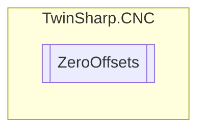

# ZeroOffsets `Public class`

## Diagram


## Members
### Methods
#### Public  methods
| Returns | Name |
| --- | --- |
| `int``[]` | [`GetZeroOffsets`](#getzerooffsets)(`int` zeroPointIndex) |
| `uint` | [`GetZeroPointHandle`](#getzeropointhandle)(`int` zeroPointIndex) |
| `void` | [`SetZeroOffset`](#setzerooffset)(`int` zeroPointIndex, `int` axisIndex, `int` offset) |

## Details
### Constructors
#### ZeroOffsets
[*Source code*](https://github.com///blob//TwinSharp/CNC/ZeroOffsets.cs#L11)
```csharp
internal ZeroOffsets(AdsClient sdaClient, int channelNumber)
```
##### Arguments
| Type | Name | Description |
| --- | --- | --- |
| `AdsClient` | sdaClient |   |
| `int` | channelNumber |   |

### Methods
#### GetZeroPointHandle
[*Source code*](https://github.com///blob//TwinSharp/CNC/ZeroOffsets.cs#L20)
```csharp
public uint GetZeroPointHandle(int zeroPointIndex)
```
##### Arguments
| Type | Name | Description |
| --- | --- | --- |
| `int` | zeroPointIndex |   |

#### GetZeroOffsets
[*Source code*](https://github.com///blob//TwinSharp/CNC/ZeroOffsets.cs#L39)
```csharp
public int GetZeroOffsets(int zeroPointIndex)
```
##### Arguments
| Type | Name | Description |
| --- | --- | --- |
| `int` | zeroPointIndex |   |

#### SetZeroOffset
[*Source code*](https://github.com///blob//TwinSharp/CNC/ZeroOffsets.cs#L62)
```csharp
public void SetZeroOffset(int zeroPointIndex, int axisIndex, int offset)
```
##### Arguments
| Type | Name | Description |
| --- | --- | --- |
| `int` | zeroPointIndex |   |
| `int` | axisIndex |   |
| `int` | offset |   |

*Generated with* [*ModularDoc*](https://github.com/hailstorm75/ModularDoc)
