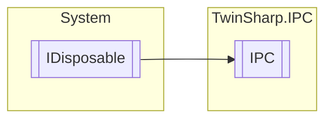

# IPC `Public class`

## Description
The IPC class represents a Beckhoff Industrial PC (IPC) and provides access to various hardware modules such as network cards, CPU, memory, display devices, operating system, fans, mainboard, UPS, and miscellaneous modules.
            It uses the AdsClient to connect to the IPC and read the available MDP modules, initializing the corresponding module objects based on their types.
            The class implements IDisposable to ensure proper disposal of the AdsClient.

## Diagram


## Members
### Properties
#### Public  properties
| Type | Name | Methods |
| --- | --- | --- |
| [`IpcCpu`](./IpcCpu.md) | [`Cpu`](#cpu)<br>Represents the CPU module of the IPC. | `get, private set` |
| [`IpcDisplayDevice`](./IpcDisplayDevice.md)`[]` | [`DisplayDevices`](#displaydevices)<br>Represents the display devices of the IPC. | `get, private set` |
| [`IpcFan`](./IpcFan.md)`[]` | [`Fans`](#fans)<br>Represents the fans of the IPC. | `get, private set` |
| [`IpcMainBoard`](./IpcMainBoard.md) | [`MainBoard`](#mainboard)<br>Represents the mainboard module of the IPC. | `get, private set` |
| [`IpcMemory`](./IpcMemory.md) | [`Memory`](#memory)<br>Represents the memory module of the IPC. | `get, private set` |
| [`IpcMiscellaneous`](./IpcMiscellaneous.md) | [`Miscellaneous`](#miscellaneous)<br>Represents the miscellaneous module of the IPC. | `get, private set` |
| [`IpcNIC`](./IpcNIC.md)`[]` | [`NICs`](#nics)<br>Represents the network cards of the IPC. | `get, private set` |
| [`IpcOperatingSystem`](./IpcOperatingSystem.md) | [`OperatingSystem`](#operatingsystem)<br>Represents the operating system module of the IPC. | `get, private set` |
| [`IpcTime`](./IpcTime.md) | [`Time`](#time)<br>Module for viewing and setting the time on the IPC. | `get, private set` |
| [`IpcTwinCAT`](./IpcTwinCAT.md) | [`TwinCAT`](#twincat)<br>Represents the TwinCAT module of the IPC. | `get, private set` |
| [`IpcUps`](./IpcUps.md) | [`UPS`](#ups)<br>Represents the UPS module of the IPC. | `get, private set` |

### Methods
#### Public  methods
| Returns | Name |
| --- | --- |
| `void` | [`Dispose`](#dispose)()<br>Disposes the ads client. |

## Details
### Summary
The IPC class represents a Beckhoff Industrial PC (IPC) and provides access to various hardware modules such as network cards, CPU, memory, display devices, operating system, fans, mainboard, UPS, and miscellaneous modules.
            It uses the AdsClient to connect to the IPC and read the available MDP modules, initializing the corresponding module objects based on their types.
            The class implements IDisposable to ensure proper disposal of the AdsClient.

### Inheritance
 - `IDisposable`

### Constructors
#### IPC
[*Source code*](https://github.com///blob//TwinSharp/IPC/IPC.cs#L20)
```csharp
public IPC(AmsNetId target)
```
##### Arguments
| Type | Name | Description |
| --- | --- | --- |
| `AmsNetId` | target | Target where to find IPC. Use AmsNetId.Local for local access. |

##### Summary
Creates an representation of a Beckhoff IPC.

### Methods
#### Dispose
[*Source code*](https://github.com///blob//TwinSharp/IPC/IPC.cs#L157)
```csharp
public virtual void Dispose()
```
##### Summary
Disposes the ads client.

### Properties
#### NICs
```csharp
public IpcNIC NICs { get; private set; }
```
##### Summary
Represents the network cards of the IPC.

#### Time
```csharp
public IpcTime Time { get; private set; }
```
##### Summary
Module for viewing and setting the time on the IPC.

#### TwinCAT
```csharp
public IpcTwinCAT TwinCAT { get; private set; }
```
##### Summary
Represents the TwinCAT module of the IPC.

#### Cpu
```csharp
public IpcCpu Cpu { get; private set; }
```
##### Summary
Represents the CPU module of the IPC.

#### Memory
```csharp
public IpcMemory Memory { get; private set; }
```
##### Summary
Represents the memory module of the IPC.

#### DisplayDevices
```csharp
public IpcDisplayDevice DisplayDevices { get; private set; }
```
##### Summary
Represents the display devices of the IPC.

#### OperatingSystem
```csharp
public IpcOperatingSystem OperatingSystem { get; private set; }
```
##### Summary
Represents the operating system module of the IPC.

#### Fans
```csharp
public IpcFan Fans { get; private set; }
```
##### Summary
Represents the fans of the IPC.

#### MainBoard
```csharp
public IpcMainBoard MainBoard { get; private set; }
```
##### Summary
Represents the mainboard module of the IPC.

#### UPS
```csharp
public IpcUps UPS { get; private set; }
```
##### Summary
Represents the UPS module of the IPC.

#### Miscellaneous
```csharp
public IpcMiscellaneous Miscellaneous { get; private set; }
```
##### Summary
Represents the miscellaneous module of the IPC.

*Generated with* [*ModularDoc*](https://github.com/hailstorm75/ModularDoc)
