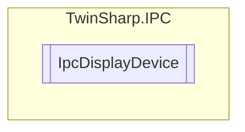

# IpcDisplayDevice `Public class`

## Description
The IpcDisplayDevice class provides an interface to interact with a display device
            connected via TwinCAT ADS. It allows reading and writing various properties of the
            display such as active display mode, display mode description, primary display status,
            COM port, version, brightness, and light enabled status. It also provides a method to
            save the brightness setting persistently across power cycles.

## Diagram


## Members
### Properties
#### Public  properties
| Type | Name | Methods |
| --- | --- | --- |
| `byte` | [`ActiveDisplayModeID`](#activedisplaymodeid)<br>ID of active display mode | `get, set` |
| `uint` | [`Brightness`](#brightness)<br>Valid values: 20-100 (20 lowest brightness, 100 maximum brightness) | `get, set` |
| `string` | [`ComPort`](#comport)<br>Windows Embedded Standard (WES): e.g. "Com4"<br>            Windows CE: under Windows CE, the Com Port must end with a colon, e.g. "COM4:" | `get, set` |
| `string` | [`DisplayModeDescription`](#displaymodedescription)<br>Description of active display mode | `get` |
| `bool` | [`IsPrimaryDisplay`](#isprimarydisplay)<br>True if this display is the primary display | `get` |
| `bool` | [`LightEnabled`](#lightenabled)<br>Valid values: TRUE = background light ON, FALSE = background light OFF | `get, set` |
| `uint` | [`Version`](#version)<br>Version of the display device | `get` |

### Methods
#### Public  methods
| Returns | Name |
| --- | --- |
| `void` | [`SaveBrightnessPersistent`](#savebrightnesspersistent)()<br>Save brightness persistent between power cycles. |

## Details
### Summary
The IpcDisplayDevice class provides an interface to interact with a display device
            connected via TwinCAT ADS. It allows reading and writing various properties of the
            display such as active display mode, display mode description, primary display status,
            COM port, version, brightness, and light enabled status. It also provides a method to
            save the brightness setting persistently across power cycles.

### Constructors
#### IpcDisplayDevice
[*Source code*](https://github.com///blob//TwinSharp/IPC/IpcDisplayDevice.cs#L23)
```csharp
internal IpcDisplayDevice(AdsClient client, ushort mdpId)
```
##### Arguments
| Type | Name | Description |
| --- | --- | --- |
| `AdsClient` | client |   |
| `ushort` | mdpId |   |

### Methods
#### SaveBrightnessPersistent
[*Source code*](https://github.com///blob//TwinSharp/IPC/IpcDisplayDevice.cs#L113)
```csharp
public void SaveBrightnessPersistent()
```
##### Summary
Save brightness persistent between power cycles.

### Properties
#### ActiveDisplayModeID
```csharp
public byte ActiveDisplayModeID { get; set; }
```
##### Summary
ID of active display mode

#### DisplayModeDescription
```csharp
public string DisplayModeDescription { get; }
```
##### Summary
Description of active display mode

#### IsPrimaryDisplay
```csharp
public bool IsPrimaryDisplay { get; }
```
##### Summary
True if this display is the primary display

#### ComPort
```csharp
public string ComPort { get; set; }
```
##### Summary
Windows Embedded Standard (WES): e.g. "Com4"
            Windows CE: under Windows CE, the Com Port must end with a colon, e.g. "COM4:"

#### Version
```csharp
public uint Version { get; }
```
##### Summary
Version of the display device

#### Brightness
```csharp
public uint Brightness { get; set; }
```
##### Summary
Valid values: 20-100 (20 lowest brightness, 100 maximum brightness)

#### LightEnabled
```csharp
public bool LightEnabled { get; set; }
```
##### Summary
Valid values: TRUE = background light ON, FALSE = background light OFF

*Generated with* [*ModularDoc*](https://github.com/hailstorm75/ModularDoc)
