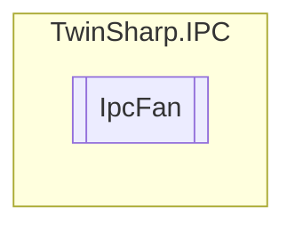

# IpcFan `Public class`

## Description
Each fan for which information is available is represented by a dedicated MDP module instance (not all devices support this).

## Diagram


## Members
### Properties
#### Public  properties
| Type | Name | Methods |
| --- | --- | --- |
| `short` | [`FanSpeedRPM`](#fanspeedrpm)<br>Fan speed (rpm) | `get` |

## Details
### Summary
Each fan for which information is available is represented by a dedicated MDP module instance (not all devices support this).

### Constructors
#### IpcFan
[*Source code*](https://github.com///blob//TwinSharp/IPC/IpcFan.cs#L15)
```csharp
internal IpcFan(AdsClient client, ushort mdpId)
```
##### Arguments
| Type | Name | Description |
| --- | --- | --- |
| `AdsClient` | client |   |
| `ushort` | mdpId |   |

### Properties
#### FanSpeedRPM
```csharp
public short FanSpeedRPM { get; }
```
##### Summary
Fan speed (rpm)

*Generated with* [*ModularDoc*](https://github.com/hailstorm75/ModularDoc)
