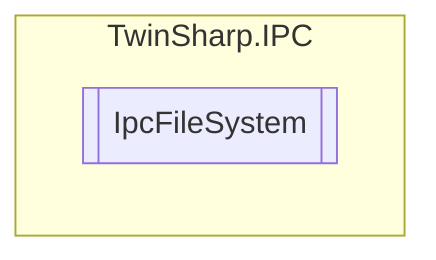

# IpcFileSystem `Public class`

## Diagram


## Details
### Constructors
#### IpcFileSystem
[*Source code*](https://github.com///blob//TwinSharp/IPC/IpcFileSystem.cs#L18)
```csharp
internal IpcFileSystem(AdsClient client, ushort mdpId)
```
##### Arguments
| Type | Name | Description |
| --- | --- | --- |
| `AdsClient` | client |   |
| `ushort` | mdpId |   |

*Generated with* [*ModularDoc*](https://github.com/hailstorm75/ModularDoc)
