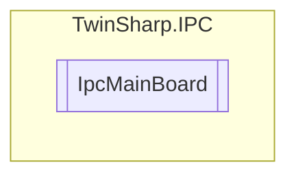

# IpcMainBoard `Public class`

## Description
This module provides mainboard information, such as type, serial number, production date, boot count, operating time, and temperature.
            This module is not supported by all devices, since it requires a special BIOS.

## Diagram


## Members
### Properties
#### Public  properties
| Type | Name | Methods |
| --- | --- | --- |
| `byte` | [`BiosMajorVersion`](#biosmajorversion)<br>BIOS major version | `get` |
| `byte` | [`BiosMinorVersion`](#biosminorversion)<br>BIOS minor version | `get` |
| `string` | [`BiosVersion`](#biosversion)<br>BIOS version | `get` |
| `uint` | [`BootCount`](#bootcount)<br>Number of times the device has been booted. | `get` |
| `byte` | [`MainBoardRevision`](#mainboardrevision)<br>Mainboard revision | `get` |
| `int` | [`MaxBoardTemperatureCelsius`](#maxboardtemperaturecelsius)<br>Highest measured temperature. | `get` |
| `int` | [`MaxInputMilliVolts`](#maxinputmillivolts)<br>Highest measured voltage. | `get` |
| `int` | [`MinBoardTemperatureCelsius`](#minboardtemperaturecelsius)<br>Lowest measured temperature. | `get` |
| `int` | [`MinInputMilliVolts`](#mininputmillivolts)<br>Lowest measured voltage. | `get` |
| `uint` | [`OperatingTimeMinutes`](#operatingtimeminutes)<br>Operating time in minutes. | `get` |
| `string` | [`ProductionDate`](#productiondate)<br>Production date of the mainboard. | `get` |
| `string` | [`SerialNumber`](#serialnumber)<br>Serial number of the mainboard. | `get` |
| `short` | [`TemperatureCelsius`](#temperaturecelsius)<br>Current mainboard temperature °C. | `get` |
| `string` | [`Type`](#type)<br>Type of the mainboard. | `get` |

## Details
### Summary
This module provides mainboard information, such as type, serial number, production date, boot count, operating time, and temperature.
            This module is not supported by all devices, since it requires a special BIOS.

### Constructors
#### IpcMainBoard
[*Source code*](https://github.com///blob//TwinSharp/IPC/IpcMainBoard.cs#L17)
```csharp
internal IpcMainBoard(AdsClient client, ushort mdpId)
```
##### Arguments
| Type | Name | Description |
| --- | --- | --- |
| `AdsClient` | client |   |
| `ushort` | mdpId |   |

### Properties
#### Type
```csharp
public string Type { get; }
```
##### Summary
Type of the mainboard.

#### SerialNumber
```csharp
public string SerialNumber { get; }
```
##### Summary
Serial number of the mainboard.

#### ProductionDate
```csharp
public string ProductionDate { get; }
```
##### Summary
Production date of the mainboard.

#### BootCount
```csharp
public uint BootCount { get; }
```
##### Summary
Number of times the device has been booted.

#### OperatingTimeMinutes
```csharp
public uint OperatingTimeMinutes { get; }
```
##### Summary
Operating time in minutes.

#### MinBoardTemperatureCelsius
```csharp
public int MinBoardTemperatureCelsius { get; }
```
##### Summary
Lowest measured temperature.

#### MaxBoardTemperatureCelsius
```csharp
public int MaxBoardTemperatureCelsius { get; }
```
##### Summary
Highest measured temperature.

#### MinInputMilliVolts
```csharp
public int MinInputMilliVolts { get; }
```
##### Summary
Lowest measured voltage.

#### MaxInputMilliVolts
```csharp
public int MaxInputMilliVolts { get; }
```
##### Summary
Highest measured voltage.

#### TemperatureCelsius
```csharp
public short TemperatureCelsius { get; }
```
##### Summary
Current mainboard temperature °C.

#### MainBoardRevision
```csharp
public byte MainBoardRevision { get; }
```
##### Summary
Mainboard revision

#### BiosMajorVersion
```csharp
public byte BiosMajorVersion { get; }
```
##### Summary
BIOS major version

#### BiosMinorVersion
```csharp
public byte BiosMinorVersion { get; }
```
##### Summary
BIOS minor version

#### BiosVersion
```csharp
public string BiosVersion { get; }
```
##### Summary
BIOS version

*Generated with* [*ModularDoc*](https://github.com/hailstorm75/ModularDoc)
