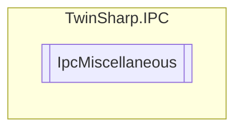

# IpcMiscellaneous `Public class`

## Description
The IpcMiscellaneous class allows reading and writing of settings such as the startup state of the Numlock key, 
            CE remote display state, security wizard enabled state, auto logon username, and auto-generate certificates. 
            The class uses an AdsClient to communicate with the system and perform these operations.

## Diagram


## Members
### Properties
#### Public  properties
| Type | Name | Methods |
| --- | --- | --- |
| `bool` | [`AutoGenerateCertificates`](#autogeneratecertificates)<br>Auto Generate Certificates | `get, set` |
| `string` | [`AutoLogonUsername`](#autologonusername)<br>Auto Logon Username | `get` |
| `bool` | [`CEremoteDisplayEnabled`](#ceremotedisplayenabled)<br>CE Remote Display Enabled<br>            (WinCE only) | `get, set` |
| `bool` | [`CEremoteDisplayState`](#ceremotedisplaystate)<br>CE remote display state shows whether a client is connected via CERHost. From MDP 1.6.x <br>            (WinCE only) | `get` |
| `bool` | [`SecurityWizardEnabled`](#securitywizardenabled)<br>Security Wizard Enabled | `get, set` |
| `bool` | [`StartupNumlockState`](#startupnumlockstate)<br>Startup Numlock State. State of the Numlock key at system start | `get, set` |

## Details
### Summary
The IpcMiscellaneous class allows reading and writing of settings such as the startup state of the Numlock key, 
            CE remote display state, security wizard enabled state, auto logon username, and auto-generate certificates. 
            The class uses an AdsClient to communicate with the system and perform these operations.

### Constructors
#### IpcMiscellaneous
[*Source code*](https://github.com///blob//TwinSharp/IPC/IpcMiscellaneous.cs#L18)
```csharp
internal IpcMiscellaneous(AdsClient client, ushort mdpId)
```
##### Arguments
| Type | Name | Description |
| --- | --- | --- |
| `AdsClient` | client |   |
| `ushort` | mdpId |   |

### Properties
#### StartupNumlockState
```csharp
public bool StartupNumlockState { get; set; }
```
##### Summary
Startup Numlock State. State of the Numlock key at system start

#### CEremoteDisplayState
```csharp
public bool CEremoteDisplayState { get; }
```
##### Summary
CE remote display state shows whether a client is connected via CERHost. From MDP 1.6.x 
            (WinCE only)

#### CEremoteDisplayEnabled
```csharp
public bool CEremoteDisplayEnabled { get; set; }
```
##### Summary
CE Remote Display Enabled
            (WinCE only)

#### SecurityWizardEnabled
```csharp
public bool SecurityWizardEnabled { get; set; }
```
##### Summary
Security Wizard Enabled

#### AutoLogonUsername
```csharp
public string AutoLogonUsername { get; }
```
##### Summary
Auto Logon Username

#### AutoGenerateCertificates
```csharp
public bool AutoGenerateCertificates { get; set; }
```
##### Summary
Auto Generate Certificates

*Generated with* [*ModularDoc*](https://github.com/hailstorm75/ModularDoc)
