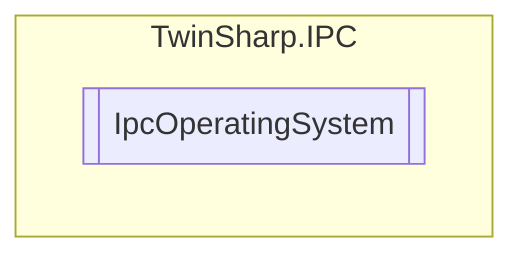

# IpcOperatingSystem `Public class`

## Description
Represents the operating system running on the IPC.
            Provides properties to retrieve OS version information, build number, CSD version, and system uptime.

## Diagram


## Members
### Properties
#### Public  properties
| Type | Name | Methods |
| --- | --- | --- |
| `uint` | [`BuildNumber`](#buildnumber)<br>OS Build Number | `get` |
| `string` | [`CSDVersion`](#csdversion)<br>OS CSD Version | `get` |
| `uint` | [`MajorVersion`](#majorversion)<br>OS Major Version | `get` |
| `uint` | [`MinorVersion`](#minorversion)<br>OS Minor Version | `get` |
| `ulong` | [`UpTimeSeconds`](#uptimeseconds)<br>Uptime in seconds | `get` |

## Details
### Summary
Represents the operating system running on the IPC.
            Provides properties to retrieve OS version information, build number, CSD version, and system uptime.

### Constructors
#### IpcOperatingSystem
[*Source code*](https://github.com///blob//TwinSharp/IPC/IpcOperatingSystem.cs#L17)
```csharp
internal IpcOperatingSystem(AdsClient client, ushort mdpId)
```
##### Arguments
| Type | Name | Description |
| --- | --- | --- |
| `AdsClient` | client |   |
| `ushort` | mdpId |   |

### Properties
#### MajorVersion
```csharp
public uint MajorVersion { get; }
```
##### Summary
OS Major Version

#### MinorVersion
```csharp
public uint MinorVersion { get; }
```
##### Summary
OS Minor Version

#### BuildNumber
```csharp
public uint BuildNumber { get; }
```
##### Summary
OS Build Number

#### CSDVersion
```csharp
public string CSDVersion { get; }
```
##### Summary
OS CSD Version

#### UpTimeSeconds
```csharp
public ulong UpTimeSeconds { get; }
```
##### Summary
Uptime in seconds

*Generated with* [*ModularDoc*](https://github.com/hailstorm75/ModularDoc)
