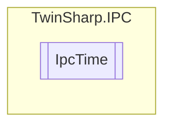

# IpcTime `Public class`

## Description
The IpcTime class provides methods to interact with time settings on the IPC.
            It allows getting and setting various time-related properties such as SNTP server address, 
            SNTP refresh interval, seconds since 1970, textual date-time representation, timezone, and time offset.

## Diagram


## Members
### Properties
#### Public  properties
| Type | Name | Methods |
| --- | --- | --- |
| `uint` | [`SNTPRefreshInSeconds`](#sntprefreshinseconds)<br>SNTP Refresh1 in Seconds<br>            On WindowsCE lowest allowed value is 5 Seconds.<br>            The system must be rebooted in order for the changes to take effect. | `get, set` |
| `string` | [`SNTPServer`](#sntpserver)<br>Name or IP Address of the timeserver<br>            "NoSync" = No synchronization<br>            "NT5DS" = Use domain hierarchy settings(Win32 only – no WinCE)<br>            May contain the following flags: See "NtpServer" msdn(Win32 only – no WinCE)<br>            The system must be rebooted in order for the changes to take effect. | `get, set` |
| `uint` | [`SecondsSince1970`](#secondssince1970)<br>Seconds since midnight January 1, 1970 (local time) | `get, set` |
| `string` | [`TextualDateTime`](#textualdatetime)<br>Textual DateTime presentation(local time)<br>            (ISO 8601) YYYY-MM-DDThh:mm:ss.sTZD | `get, set` |
| `int` | [`TimeOffset`](#timeoffset)<br>Time Offset – offset in seconds of the current local time relative to the coordinated universal time (UTC)<br>            (supports only steps of 15 minutes = 900 seconds)<br>            only for TC/RTOS | `get, set` |
| `ushort` | [`Timezone`](#timezone)<br>Timezone - Zero based index of currently active timezone as listed in object 0x8nn2.Sub indizes in Oject 0x8nn2 are one based.To lookup timezone information you need to query sub idx @ "this value"+1<br>            Not for TC/RTOS | `get, set` |

## Details
### Summary
The IpcTime class provides methods to interact with time settings on the IPC.
            It allows getting and setting various time-related properties such as SNTP server address, 
            SNTP refresh interval, seconds since 1970, textual date-time representation, timezone, and time offset.

### Constructors
#### IpcTime
[*Source code*](https://github.com///blob//TwinSharp/IPC/IpcTime.cs#L17)
```csharp
internal IpcTime(AdsClient client, ushort mdpId)
```
##### Arguments
| Type | Name | Description |
| --- | --- | --- |
| `AdsClient` | client |   |
| `ushort` | mdpId |   |

### Properties
#### SNTPServer
```csharp
public string SNTPServer { get; set; }
```
##### Summary
Name or IP Address of the timeserver
            "NoSync" = No synchronization
            "NT5DS" = Use domain hierarchy settings(Win32 only – no WinCE)
            May contain the following flags: See "NtpServer" msdn(Win32 only – no WinCE)
            The system must be rebooted in order for the changes to take effect.

#### SNTPRefreshInSeconds
```csharp
public uint SNTPRefreshInSeconds { get; set; }
```
##### Summary
SNTP Refresh1 in Seconds
            On WindowsCE lowest allowed value is 5 Seconds.
            The system must be rebooted in order for the changes to take effect.

#### SecondsSince1970
```csharp
public uint SecondsSince1970 { get; set; }
```
##### Summary
Seconds since midnight January 1, 1970 (local time)

#### TextualDateTime
```csharp
public string TextualDateTime { get; set; }
```
##### Summary
Textual DateTime presentation(local time)
            (ISO 8601) YYYY-MM-DDThh:mm:ss.sTZD

#### Timezone
```csharp
public ushort Timezone { get; set; }
```
##### Summary
Timezone - Zero based index of currently active timezone as listed in object 0x8nn2.Sub indizes in Oject 0x8nn2 are one based.To lookup timezone information you need to query sub idx @ "this value"+1
            Not for TC/RTOS

#### TimeOffset
```csharp
public int TimeOffset { get; set; }
```
##### Summary
Time Offset – offset in seconds of the current local time relative to the coordinated universal time (UTC)
            (supports only steps of 15 minutes = 900 seconds)
            only for TC/RTOS

*Generated with* [*ModularDoc*](https://github.com/hailstorm75/ModularDoc)
