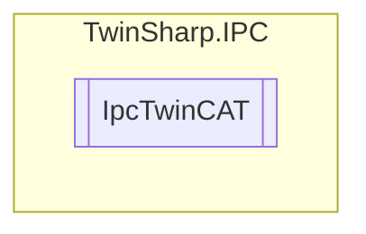

# IpcTwinCAT `Public class`

## Description
The IpcTwinCAT class provides an interface to interact with a TwinCAT system using an AdsClient.
            It allows reading various system properties such as version, status, and configuration details.
            The class handles specific TwinCAT system attributes and provides methods to read these attributes
            from the TwinCAT system using ADS (Automation Device Specification) protocol.

## Diagram


## Members
### Properties
#### Public  properties
| Type | Name | Methods |
| --- | --- | --- |
| `string` | [`AmsNetID`](#amsnetid)<br>AMS Net ID of the TwinCAT system. A restart of the computer is required in order to make a change to the Ams Net ID. | `get` |
| `ushort` | [`BuildNumber`](#buildnumber)<br>TwinCAT build number. | `get` |
| `ushort` | [`Length`](#length)<br>Length of the structure | `get` |
| `string` | [`LogFilePath`](#logfilepath)<br>Only for WindowsCE | `get` |
| `uint` | [`LogFileSize`](#logfilesize)<br>Only for WindowsCE | `get` |
| `ushort` | [`MajorVersion`](#majorversion)<br>TwinCAT major version. | `get` |
| `ushort` | [`MinorVersion`](#minorversion)<br>TwinCAT minor version. | `get` |
| `uint` | [`RegLevel`](#reglevel)<br>Only for TwinCAT 2. | `get` |
| `ushort` | [`Revision`](#revision)<br>TwinCAT Revision | `get` |
| `ushort` | [`RunAsDevice`](#runasdevice)<br>Only for WindowsCE | `get` |
| `ulong` | [`SecondsSinceLastStatusChange`](#secondssincelaststatuschange)<br>Seconds since last TwinCAT status change | `get` |
| `ushort` | [`ShowTargetVisu`](#showtargetvisu)<br>Only for WindowsCE | `get` |
| `ushort` | [`Status`](#status)<br>Status of the TwinCAT system. | `get` |
| `string` | [`SystemID`](#systemid)<br>TwinCAT System ID | `get` |

## Details
### Summary
The IpcTwinCAT class provides an interface to interact with a TwinCAT system using an AdsClient.
            It allows reading various system properties such as version, status, and configuration details.
            The class handles specific TwinCAT system attributes and provides methods to read these attributes
            from the TwinCAT system using ADS (Automation Device Specification) protocol.

### Constructors
#### IpcTwinCAT
[*Source code*](https://github.com///blob//TwinSharp/IPC/IpcTwinCAT.cs#L19)
```csharp
internal IpcTwinCAT(AdsClient client, ushort mdpId)
```
##### Arguments
| Type | Name | Description |
| --- | --- | --- |
| `AdsClient` | client |   |
| `ushort` | mdpId |   |

### Properties
#### Length
```csharp
public ushort Length { get; }
```
##### Summary
Length of the structure

#### MajorVersion
```csharp
public ushort MajorVersion { get; }
```
##### Summary
TwinCAT major version.

#### MinorVersion
```csharp
public ushort MinorVersion { get; }
```
##### Summary
TwinCAT minor version.

#### BuildNumber
```csharp
public ushort BuildNumber { get; }
```
##### Summary
TwinCAT build number.

#### AmsNetID
```csharp
public string AmsNetID { get; }
```
##### Summary
AMS Net ID of the TwinCAT system. A restart of the computer is required in order to make a change to the Ams Net ID.

#### RegLevel
```csharp
public uint RegLevel { get; }
```
##### Summary
Only for TwinCAT 2.

#### Status
```csharp
public ushort Status { get; }
```
##### Summary
Status of the TwinCAT system.

#### RunAsDevice
```csharp
public ushort RunAsDevice { get; }
```
##### Summary
Only for WindowsCE

#### ShowTargetVisu
```csharp
public ushort ShowTargetVisu { get; }
```
##### Summary
Only for WindowsCE

#### LogFileSize
```csharp
public uint LogFileSize { get; }
```
##### Summary
Only for WindowsCE

#### LogFilePath
```csharp
public string LogFilePath { get; }
```
##### Summary
Only for WindowsCE

#### SystemID
```csharp
public string SystemID { get; }
```
##### Summary
TwinCAT System ID

#### Revision
```csharp
public ushort Revision { get; }
```
##### Summary
TwinCAT Revision

#### SecondsSinceLastStatusChange
```csharp
public ulong SecondsSinceLastStatusChange { get; }
```
##### Summary
Seconds since last TwinCAT status change

*Generated with* [*ModularDoc*](https://github.com/hailstorm75/ModularDoc)
