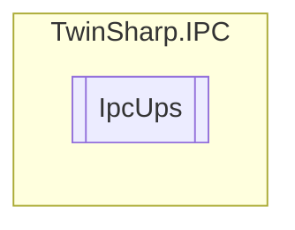

# IpcUps `Public class`

## Description
The IpcUps class provides an interface to interact with an Uninterruptible Power Supply (UPS) device
            using the TwinCAT ADS protocol. It allows reading various properties of the UPS such as model, vendor name,
            version, revision, build, serial number, power status, communication status, battery status, battery capacity,
            battery runtime, persistent power fail count, power fail counter, fan error, no battery status, battery replace date,
            and interval service status. The class uses an AdsClient to communicate with the UPS device.

## Diagram


## Members
### Properties
#### Public  properties
| Type | Name | Methods |
| --- | --- | --- |
| `byte` | [`BatteryCapacityPercent`](#batterycapacitypercent)<br>Battery capacity in percent. | `get` |
| `string` | [`BatteryReplaceDate`](#batteryreplacedate)<br>Date of the last battery change. | `get` |
| `uint` | [`BatteryRuntimeSeconds`](#batteryruntimeseconds)<br>Battery runtime in seconds. | `get` |
| `byte` | [`BatteryStatus`](#batterystatus)<br>Battery status. | `get` |
| `ushort` | [`Build`](#build)<br>Build. | `get` |
| `byte` | [`CommunicationStatus`](#communicationstatus)<br>Communication status. | `get` |
| `bool` | [`FanError`](#fanerror)<br>Fan error. | `get` |
| `bool` | [`IntervalServiceStatus`](#intervalservicestatus)<br>Interval Service Status indicates whether the configured service interval has elapsed. | `get` |
| `bool` | [`NoBattery`](#nobattery)<br>No battery. | `get` |
| `bool` | [`PersistentPowerFailCount`](#persistentpowerfailcount)<br>Persistent Power Fail Count | `get` |
| `uint` | [`PowerFailCounter`](#powerfailcounter)<br>Power fail counter. | `get` |
| `byte` | [`PowerStatus`](#powerstatus)<br>Power status. | `get` |
| `byte` | [`Revision`](#revision)<br>Revision. | `get` |
| `string` | [`SerialNumber`](#serialnumber)<br>Serial number. | `get` |
| `string` | [`UPSModel`](#upsmodel)<br>UPS Model. | `get` |
| `string` | [`VendorName`](#vendorname)<br>Vendor name. | `get` |
| `byte` | [`Version`](#version)<br>Version. | `get` |

## Details
### Summary
The IpcUps class provides an interface to interact with an Uninterruptible Power Supply (UPS) device
            using the TwinCAT ADS protocol. It allows reading various properties of the UPS such as model, vendor name,
            version, revision, build, serial number, power status, communication status, battery status, battery capacity,
            battery runtime, persistent power fail count, power fail counter, fan error, no battery status, battery replace date,
            and interval service status. The class uses an AdsClient to communicate with the UPS device.

### Constructors
#### IpcUps
[*Source code*](https://github.com///blob//TwinSharp/IPC/IpcUps.cs#L19)
```csharp
internal IpcUps(AdsClient client, ushort mdpId)
```
##### Arguments
| Type | Name | Description |
| --- | --- | --- |
| `AdsClient` | client |   |
| `ushort` | mdpId |   |

### Properties
#### UPSModel
```csharp
public string UPSModel { get; }
```
##### Summary
UPS Model.

#### VendorName
```csharp
public string VendorName { get; }
```
##### Summary
Vendor name.

#### Version
```csharp
public byte Version { get; }
```
##### Summary
Version.

#### Revision
```csharp
public byte Revision { get; }
```
##### Summary
Revision.

#### Build
```csharp
public ushort Build { get; }
```
##### Summary
Build.

#### SerialNumber
```csharp
public string SerialNumber { get; }
```
##### Summary
Serial number.

#### PowerStatus
```csharp
public byte PowerStatus { get; }
```
##### Summary
Power status.

#### CommunicationStatus
```csharp
public byte CommunicationStatus { get; }
```
##### Summary
Communication status.

#### BatteryStatus
```csharp
public byte BatteryStatus { get; }
```
##### Summary
Battery status.

#### BatteryCapacityPercent
```csharp
public byte BatteryCapacityPercent { get; }
```
##### Summary
Battery capacity in percent.

#### BatteryRuntimeSeconds
```csharp
public uint BatteryRuntimeSeconds { get; }
```
##### Summary
Battery runtime in seconds.

#### PersistentPowerFailCount
```csharp
public bool PersistentPowerFailCount { get; }
```
##### Summary
Persistent Power Fail Count

#### PowerFailCounter
```csharp
public uint PowerFailCounter { get; }
```
##### Summary
Power fail counter.

#### FanError
```csharp
public bool FanError { get; }
```
##### Summary
Fan error.

#### NoBattery
```csharp
public bool NoBattery { get; }
```
##### Summary
No battery.

#### BatteryReplaceDate
```csharp
public string BatteryReplaceDate { get; }
```
##### Summary
Date of the last battery change.

#### IntervalServiceStatus
```csharp
public bool IntervalServiceStatus { get; }
```
##### Summary
Interval Service Status indicates whether the configured service interval has elapsed.

*Generated with* [*ModularDoc*](https://github.com/hailstorm75/ModularDoc)
