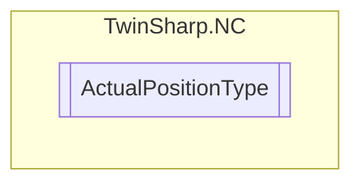

# ActualPositionType `Public enum`

## Diagram

## Details
### Fields
#### NOT_DEFINED

#### AbsolutePosition

#### RelativePosition

#### ModuloPosition

*Generated with* [*ModularDoc*](https://github.com/hailstorm75/ModularDoc)
