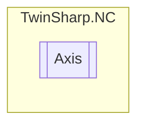

# Axis `Public class`

## Description
Represents an axis in a TwinCAT NC system, encapsulating its functions, parameters, state, cyclic process data, and associated sub-elements such as encoders, controllers, and drives.

## Diagram


## Members
### Properties
#### Public  properties
| Type | Name | Methods |
| --- | --- | --- |
| [`Controller`](./Controller.md)`[]` | [`Controllers`](#controllers)<br>Gets the array of controllers associated with the axis. | `get, private set` |
| [`AxisCyclicProcessData`](./AxisCyclicProcessData.md) | [`CyclicProcessData`](#cyclicprocessdata)<br>Gets the cyclic process data of the axis. | `get, private set` |
| [`Drive`](./Drive.md)`[]` | [`Drives`](#drives)<br>Gets the array of drives associated with the axis. | `get, private set` |
| [`Encoder`](./Encoder.md)`[]` | [`Encoders`](#encoders)<br>Gets the array of encoders associated with the axis. | `get, private set` |
| [`AxisFunctions`](./AxisFunctions.md) | [`Functions`](#functions)<br>Gets the functions available for the axis. | `get, private set` |
| [`AxisParameters`](./AxisParameters.md) | [`Parameters`](#parameters)<br>Gets the parameters of the axis. | `get, private set` |
| [`AxisState`](./AxisState.md) | [`State`](#state)<br>Gets the state of the axis. | `get, private set` |

### Methods
#### Public  methods
| Returns | Name |
| --- | --- |
| `string` | [`ToString`](#tostring)()<br>Returns the name of the axis. |

## Details
### Summary
Represents an axis in a TwinCAT NC system, encapsulating its functions, parameters, state, cyclic process data, and associated sub-elements such as encoders, controllers, and drives.

### Constructors
#### Axis
[*Source code*](https://github.com///blob//TwinSharp/NC/Axis.cs#L15)
```csharp
public Axis(AdsClient client, uint id)
```
##### Arguments
| Type | Name | Description |
| --- | --- | --- |
| `AdsClient` | client |  |
| `uint` | id |  |

##### Summary
Creates a new axis object representation of the given ID.

### Methods
#### ToString
[*Source code*](https://github.com///blob//TwinSharp/NC/Axis.cs#L86)
```csharp
public override string ToString()
```
##### Summary
Returns the name of the axis.

##### Returns


### Properties
#### Encoders
```csharp
public Encoder Encoders { get; private set; }
```
##### Summary
Gets the array of encoders associated with the axis.

#### Functions
```csharp
public AxisFunctions Functions { get; private set; }
```
##### Summary
Gets the functions available for the axis.

#### Parameters
```csharp
public AxisParameters Parameters { get; private set; }
```
##### Summary
Gets the parameters of the axis.

#### State
```csharp
public AxisState State { get; private set; }
```
##### Summary
Gets the state of the axis.

#### Controllers
```csharp
public Controller Controllers { get; private set; }
```
##### Summary
Gets the array of controllers associated with the axis.

#### Drives
```csharp
public Drive Drives { get; private set; }
```
##### Summary
Gets the array of drives associated with the axis.

#### CyclicProcessData
```csharp
public AxisCyclicProcessData CyclicProcessData { get; private set; }
```
##### Summary
Gets the cyclic process data of the axis.

*Generated with* [*ModularDoc*](https://github.com/hailstorm75/ModularDoc)
