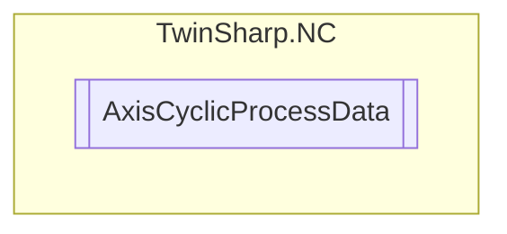

# AxisCyclicProcessData `Public class`

## Description
The AxisCyclicProcessData class provides properties to interact with the cyclic process data of an axis in a TwinCAT NC system.
            It uses an AdsClient to read and write various control and status parameters of the axis, such as control word, controller enable,
            feed enable, referencing cam, velocity override, operation mode, actual position correction value, and external controller component.
            If the axis is linked to a PLC object, most of these values will be refused.

## Diagram


## Members
### Properties
#### Public  properties
| Type | Name | Methods |
| --- | --- | --- |
| `double` | [`ActualPositionCorrectionValue`](#actualpositioncorrectionvalue)<br>Actual position correction value (measurement system error correction) | `get, set` |
| `int` | [`ControlWord`](#controlword)<br>Control double word | `get, set` |
| `bool` | [`ControllerEnable`](#controllerenable)<br>Controller enable | `get, set` |
| `double` | [`ExternalControllerComponent`](#externalcontrollercomponent)<br>External controller component (position controller component) | `get, set` |
| `bool` | [`FeedEnableMinus`](#feedenableminus)<br>Feed enable minus | `get, set` |
| `bool` | [`FeedEnablePlus`](#feedenableplus)<br>Feed enable plus | `get, set` |
| `uint` | [`OperationMode`](#operationmode)<br>Operation mode axis | `get, set` |
| `bool` | [`ReferencingCam`](#referencingcam)<br>Referencing cam | `get, set` |
| `uint` | [`VelocityOverride`](#velocityoverride)<br>Velocity override (1000000 == 100%) | `get, set` |

## Details
### Summary
The AxisCyclicProcessData class provides properties to interact with the cyclic process data of an axis in a TwinCAT NC system.
            It uses an AdsClient to read and write various control and status parameters of the axis, such as control word, controller enable,
            feed enable, referencing cam, velocity override, operation mode, actual position correction value, and external controller component.
            If the axis is linked to a PLC object, most of these values will be refused.

### Constructors
#### AxisCyclicProcessData
[*Source code*](https://github.com///blob//TwinSharp/NC/AxisCyclicProcessData.cs#L15)
```csharp
internal AxisCyclicProcessData(AdsClient client, uint id)
```
##### Arguments
| Type | Name | Description |
| --- | --- | --- |
| `AdsClient` | client |   |
| `uint` | id |   |

### Properties
#### ControlWord
```csharp
public int ControlWord { get; set; }
```
##### Summary
Control double word

#### ControllerEnable
```csharp
public bool ControllerEnable { get; set; }
```
##### Summary
Controller enable

#### FeedEnablePlus
```csharp
public bool FeedEnablePlus { get; set; }
```
##### Summary
Feed enable plus

#### FeedEnableMinus
```csharp
public bool FeedEnableMinus { get; set; }
```
##### Summary
Feed enable minus

#### ReferencingCam
```csharp
public bool ReferencingCam { get; set; }
```
##### Summary
Referencing cam

#### VelocityOverride
```csharp
public uint VelocityOverride { get; set; }
```
##### Summary
Velocity override (1000000 == 100%)

#### OperationMode
```csharp
public uint OperationMode { get; set; }
```
##### Summary
Operation mode axis

#### ActualPositionCorrectionValue
```csharp
public double ActualPositionCorrectionValue { get; set; }
```
##### Summary
Actual position correction value (measurement system error correction)

#### ExternalControllerComponent
```csharp
public double ExternalControllerComponent { get; set; }
```
##### Summary
External controller component (position controller component)

*Generated with* [*ModularDoc*](https://github.com/hailstorm75/ModularDoc)
