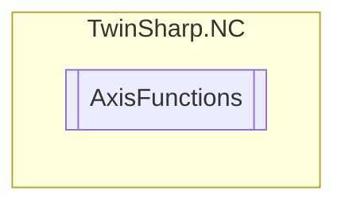

# AxisFunctions `Public class`

## Description
The AxisFunctions class provides a set of methods to control and manage the behavior of an axis in a TwinCAT NC system.
            It allows for operations such as resetting, stopping, referencing, and setting positions of the axis.
            Additionally, it supports advanced operations like controlled ramps, emergency stops, reversing operations, and sinus oscillation sequences.
            The class interacts with the TwinCAT system using an AdsClient to send commands and data to the specified axis.

## Diagram


## Members
### Methods
#### Public  methods
| Returns | Name |
| --- | --- |
| `void` | [`ActivateCompleteAxis`](#activatecompleteaxis)()<br>Activate complete axis (enable) |
| `void` | [`ActivateDriveOutput`](#activatedriveoutput)()<br>Activate drive output (enable). |
| `void` | [`ChangeDriveOutput`](#changedriveoutput)([`DriveOutputStartType`](./DriveOutputStartType.md) startType, `double` newValue)<br>Change the drive output. |
| `void` | [`ClearAxisTask`](#clearaxistask)()<br>Clear axis (task) |
| `void` | [`DeactivateCompleteAxis`](#deactivatecompleteaxis)()<br>Deactivate complete axis (disable) |
| `void` | [`DeactivateDriveOutput`](#deactivatedriveoutput)()<br>Deactivate drive output (disable). |
| `void` | [`EmergencyStopWithControlledRamp`](#emergencystopwithcontrolledramp)(`double` deceleration, `double` jerk)<br>Emergency stop with controlled ramp |
| `void` | [`ExtendedAxisStart`](#extendedaxisstart)([`GroupAxisStartType`](./GroupAxisStartType.md) startType, `double` targetPosition, `double` requireVelocity, `double` acceleration, `double` deceleration, `double` jerk)<br>Extended axis start. |
| `void` | [`NewEndPositionAxis`](#newendpositionaxis)([`EndPositionType`](./EndPositionType.md) endPositionType, `double` newEndPosition)<br>Set new end position (axis). |
| `void` | [`OrientedStop`](#orientedstop)(`double` moduloEndPosition, `double` deceleration, `double` jerk)<br>Oriented stop (oriented end position). Only for PTP axes. |
| `void` | [`ReferenceAxis`](#referenceaxis)()<br>Reference axis (calibration). |
| `void` | [`ReleaseParkingBrake`](#releaseparkingbrake)(`ushort` release)<br>Release parking brake?<br>            0: automatic activation(default) <br>            1: mandatorily always released <br>            Note: Reset to '0' when resetting the axis! |
| `void` | [`Reset`](#reset)()<br>Reset axis |
| `void` | [`SetActualAxisPosition`](#setactualaxisposition)([`ActualPositionType`](./ActualPositionType.md) actualPositionType, `double` actualPosition)<br>Set actual axis position |
| `void` | [`SetActualPositionOnTheFly`](#setactualpositiononthefly)([`ActualPositionType`](./ActualPositionType.md) positionType, `int` controlword, `double` newActualPosition)<br>Set actual axis position on the fly (in motion of the axis) |
| `void` | [`SetExternalAxisError`](#setexternalaxiserror)(`uint` errorCode)<br>Set external axis error (runtime error) |
| `void` | [`StandardAxisStart`](#standardaxisstart)([`GroupAxisStartType`](./GroupAxisStartType.md) startType, `double` endPosition, `double` velocity)<br>Standard axis start. |
| `void` | [`StartDriveOutput`](#startdriveoutput)([`DriveOutputStartType`](./DriveOutputStartType.md) startType, `double` value)<br>Start drive output. |
| `void` | [`StartReversingOperation`](#startreversingoperation)([`GroupAxisStartType`](./GroupAxisStartType.md) startType, `double` targePosition1, `double` targetPosition2, `double` velocity, `double` idleSeconds)<br>Start reversing operation for positioning (SERVO). |
| `void` | [`StartReversingOperationVelocityJumps`](#startreversingoperationvelocityjumps)([`GroupAxisStartType`](./GroupAxisStartType.md) startType, `double` velocity1, `double` velocity2, `double` travelSeconds, `double` idleSeconds, `uint` repetitionCount)<br>Start reversing operation with velocity jumps (SERVO):<br>            (can be used to determine the velocity step response) |
| `void` | [`StartSinusOscillationSequence`](#startsinusoscillationsequence)(`double` baseAmplitude, `double` baseFrequency, `double` startAmplitude, `double` feedConstantMotor, `double` startFrequency, `double` stopFrequency, `double` stepDurationSeconds, `uint` stepCycles)<br>Sine oscillation sequence<br>            - used as single sinus oscillation(sinus generator)<br>            - used as sinus oscillation sequence(e.g. for bode plot) |
| `void` | [`Stop`](#stop)()<br>Stop axis |
| `void` | [`StopDriveOutput`](#stopdriveoutput)()<br>Stop drive output. |
| `void` | [`StopWithControlledRamp`](#stopwithcontrolledramp)(`double` deceleration, `double` jerk)<br>Parameterizable stop (with controlled ramp). Only for PTP axes. |

## Details
### Summary
The AxisFunctions class provides a set of methods to control and manage the behavior of an axis in a TwinCAT NC system.
            It allows for operations such as resetting, stopping, referencing, and setting positions of the axis.
            Additionally, it supports advanced operations like controlled ramps, emergency stops, reversing operations, and sinus oscillation sequences.
            The class interacts with the TwinCAT system using an AdsClient to send commands and data to the specified axis.

### Constructors
#### AxisFunctions
[*Source code*](https://github.com///blob//TwinSharp/NC/AxisFunctions.cs#L17)
```csharp
internal AxisFunctions(AdsClient client, uint id)
```
##### Arguments
| Type | Name | Description |
| --- | --- | --- |
| `AdsClient` | client |   |
| `uint` | id |   |

### Methods
#### Reset
[*Source code*](https://github.com///blob//TwinSharp/NC/AxisFunctions.cs#L27)
```csharp
public void Reset()
```
##### Summary
Reset axis

#### Stop
[*Source code*](https://github.com///blob//TwinSharp/NC/AxisFunctions.cs#L35)
```csharp
public void Stop()
```
##### Summary
Stop axis

#### ClearAxisTask
[*Source code*](https://github.com///blob//TwinSharp/NC/AxisFunctions.cs#L43)
```csharp
public void ClearAxisTask()
```
##### Summary
Clear axis (task)

#### EmergencyStopWithControlledRamp
[*Source code*](https://github.com///blob//TwinSharp/NC/AxisFunctions.cs#L53)
```csharp
public void EmergencyStopWithControlledRamp(double deceleration, double jerk)
```
##### Arguments
| Type | Name | Description |
| --- | --- | --- |
| `double` | deceleration | Deceleration (must be greater than or equal to the original deceleration) |
| `double` | jerk | Jerk (must greater than or equal to the original jerk) |

##### Summary
Emergency stop with controlled ramp

#### StopWithControlledRamp
[*Source code*](https://github.com///blob//TwinSharp/NC/AxisFunctions.cs#L69)
```csharp
public void StopWithControlledRamp(double deceleration, double jerk)
```
##### Arguments
| Type | Name | Description |
| --- | --- | --- |
| `double` | deceleration |  |
| `double` | jerk |  |

##### Summary
Parameterizable stop (with controlled ramp). Only for PTP axes.

#### OrientedStop
[*Source code*](https://github.com///blob//TwinSharp/NC/AxisFunctions.cs#L86)
```csharp
public void OrientedStop(double moduloEndPosition, double deceleration, double jerk)
```
##### Arguments
| Type | Name | Description |
| --- | --- | --- |
| `double` | moduloEndPosition |  |
| `double` | deceleration |  |
| `double` | jerk |  |

##### Summary
Oriented stop (oriented end position). Only for PTP axes.

#### ReferenceAxis
[*Source code*](https://github.com///blob//TwinSharp/NC/AxisFunctions.cs#L101)
```csharp
public void ReferenceAxis()
```
##### Summary
Reference axis (calibration).

#### NewEndPositionAxis
[*Source code*](https://github.com///blob//TwinSharp/NC/AxisFunctions.cs#L111)
```csharp
public void NewEndPositionAxis(EndPositionType endPositionType, double newEndPosition)
```
##### Arguments
| Type | Name | Description |
| --- | --- | --- |
| [`EndPositionType`](./EndPositionType.md) | endPositionType |  |
| `double` | newEndPosition | New end position (target position) |

##### Summary
Set new end position (axis).

#### SetExternalAxisError
[*Source code*](https://github.com///blob//TwinSharp/NC/AxisFunctions.cs#L128)
```csharp
public void SetExternalAxisError(uint errorCode)
```
##### Arguments
| Type | Name | Description |
| --- | --- | --- |
| `uint` | errorCode |  |

##### Summary
Set external axis error (runtime error)

#### SetActualAxisPosition
[*Source code*](https://github.com///blob//TwinSharp/NC/AxisFunctions.cs#L138)
```csharp
public void SetActualAxisPosition(ActualPositionType actualPositionType, double actualPosition)
```
##### Arguments
| Type | Name | Description |
| --- | --- | --- |
| [`ActualPositionType`](./ActualPositionType.md) | actualPositionType |  |
| `double` | actualPosition |  |

##### Summary
Set actual axis position

#### SetActualPositionOnTheFly
[*Source code*](https://github.com///blob//TwinSharp/NC/AxisFunctions.cs#L156)
```csharp
public void SetActualPositionOnTheFly(ActualPositionType positionType, int controlword, double newActualPosition)
```
##### Arguments
| Type | Name | Description |
| --- | --- | --- |
| [`ActualPositionType`](./ActualPositionType.md) | positionType |  |
| `int` | controlword | Control double word, e.g. for "clearing the lag error |
| `double` | newActualPosition |  |

##### Summary
Set actual axis position on the fly (in motion of the axis)

#### StandardAxisStart
[*Source code*](https://github.com///blob//TwinSharp/NC/AxisFunctions.cs#L177)
```csharp
public void StandardAxisStart(GroupAxisStartType startType, double endPosition, double velocity)
```
##### Arguments
| Type | Name | Description |
| --- | --- | --- |
| [`GroupAxisStartType`](./GroupAxisStartType.md) | startType |  |
| `double` | endPosition |  |
| `double` | velocity |  |

##### Summary
Standard axis start.

#### ExtendedAxisStart
[*Source code*](https://github.com///blob//TwinSharp/NC/AxisFunctions.cs#L199)
```csharp
public void ExtendedAxisStart(GroupAxisStartType startType, double targetPosition, double requireVelocity, double acceleration, double deceleration, double jerk)
```
##### Arguments
| Type | Name | Description |
| --- | --- | --- |
| [`GroupAxisStartType`](./GroupAxisStartType.md) | startType |  |
| `double` | targetPosition |  |
| `double` | requireVelocity |  |
| `double` | acceleration | 0 if internal TwinCAT acceleration should be used. |
| `double` | deceleration | 0 if internal TwiNCAT deceleration should be used. |
| `double` | jerk | 0 if internal TwinCAT jerk should be used. |

##### Summary
Extended axis start.

#### StartReversingOperation
[*Source code*](https://github.com///blob//TwinSharp/NC/AxisFunctions.cs#L236)
```csharp
public void StartReversingOperation(GroupAxisStartType startType, double targePosition1, double targetPosition2, double velocity, double idleSeconds)
```
##### Arguments
| Type | Name | Description |
| --- | --- | --- |
| [`GroupAxisStartType`](./GroupAxisStartType.md) | startType |  |
| `double` | targePosition1 |  |
| `double` | targetPosition2 |  |
| `double` | velocity |  |
| `double` | idleSeconds |  |

##### Summary
Start reversing operation for positioning (SERVO).

#### StartDriveOutput
[*Source code*](https://github.com///blob//TwinSharp/NC/AxisFunctions.cs#L255)
```csharp
public void StartDriveOutput(DriveOutputStartType startType, double value)
```
##### Arguments
| Type | Name | Description |
| --- | --- | --- |
| [`DriveOutputStartType`](./DriveOutputStartType.md) | startType |  |
| `double` | value |  |

##### Summary
Start drive output.

#### StopDriveOutput
[*Source code*](https://github.com///blob//TwinSharp/NC/AxisFunctions.cs#L270)
```csharp
public void StopDriveOutput()
```
##### Summary
Stop drive output.

#### ChangeDriveOutput
[*Source code*](https://github.com///blob//TwinSharp/NC/AxisFunctions.cs#L280)
```csharp
public void ChangeDriveOutput(DriveOutputStartType startType, double newValue)
```
##### Arguments
| Type | Name | Description |
| --- | --- | --- |
| [`DriveOutputStartType`](./DriveOutputStartType.md) | startType |  |
| `double` | newValue | Required output value (e.g. %) |

##### Summary
Change the drive output.

#### StartReversingOperationVelocityJumps
[*Source code*](https://github.com///blob//TwinSharp/NC/AxisFunctions.cs#L303)
```csharp
public void StartReversingOperationVelocityJumps(GroupAxisStartType startType, double velocity1, double velocity2, double travelSeconds, double idleSeconds, uint repetitionCount)
```
##### Arguments
| Type | Name | Description |
| --- | --- | --- |
| [`GroupAxisStartType`](./GroupAxisStartType.md) | startType |  |
| `double` | velocity1 |  |
| `double` | velocity2 |  |
| `double` | travelSeconds |  |
| `double` | idleSeconds |  |
| `uint` | repetitionCount |  |

##### Summary
Start reversing operation with velocity jumps (SERVO):
            (can be used to determine the velocity step response)

#### StartSinusOscillationSequence
[*Source code*](https://github.com///blob//TwinSharp/NC/AxisFunctions.cs#L333)
```csharp
public void StartSinusOscillationSequence(double baseAmplitude, double baseFrequency, double startAmplitude, double feedConstantMotor, double startFrequency, double stopFrequency, double stepDurationSeconds, uint stepCycles)
```
##### Arguments
| Type | Name | Description |
| --- | --- | --- |
| `double` | baseAmplitude |  |
| `double` | baseFrequency |  |
| `double` | startAmplitude |  |
| `double` | feedConstantMotor |  |
| `double` | startFrequency |  |
| `double` | stopFrequency |  |
| `double` | stepDurationSeconds |  |
| `uint` | stepCycles |  |

##### Summary
Sine oscillation sequence
            - used as single sinus oscillation(sinus generator)
            - used as sinus oscillation sequence(e.g. for bode plot)

#### DeactivateCompleteAxis
[*Source code*](https://github.com///blob//TwinSharp/NC/AxisFunctions.cs#L356)
```csharp
public void DeactivateCompleteAxis()
```
##### Summary
Deactivate complete axis (disable)

#### ActivateCompleteAxis
[*Source code*](https://github.com///blob//TwinSharp/NC/AxisFunctions.cs#L364)
```csharp
public void ActivateCompleteAxis()
```
##### Summary
Activate complete axis (enable)

#### DeactivateDriveOutput
[*Source code*](https://github.com///blob//TwinSharp/NC/AxisFunctions.cs#L372)
```csharp
public void DeactivateDriveOutput()
```
##### Summary
Deactivate drive output (disable).

#### ActivateDriveOutput
[*Source code*](https://github.com///blob//TwinSharp/NC/AxisFunctions.cs#L380)
```csharp
public void ActivateDriveOutput()
```
##### Summary
Activate drive output (enable).

#### ReleaseParkingBrake
[*Source code*](https://github.com///blob//TwinSharp/NC/AxisFunctions.cs#L392)
```csharp
public void ReleaseParkingBrake(ushort release)
```
##### Arguments
| Type | Name | Description |
| --- | --- | --- |
| `ushort` | release |  |

##### Summary
Release parking brake?
            0: automatic activation(default) 
            1: mandatorily always released 
            Note: Reset to '0' when resetting the axis!

*Generated with* [*ModularDoc*](https://github.com/hailstorm75/ModularDoc)
