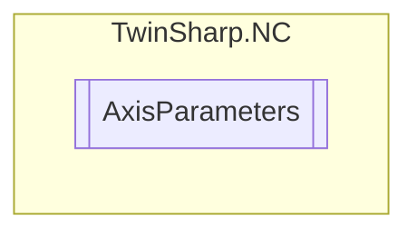

# AxisParameters `Public class`

## Description
Represents the parameters of an axis in a TwinCAT NC system.
            This class provides properties to get and set various parameters of an axis,
            such as ID, name, type, cycle time, physical unit, velocities, monitoring settings,
            error reaction mode, and more. It uses an AdsClient to read and write these parameters
            from a TwinCAT system. The class also includes methods to read all sub-elements like
            encoder IDs, controller IDs, and drive IDs.

## Diagram


## Members
### Properties
#### Public  properties
| Type | Name | Methods |
| --- | --- | --- |
| `double` | [`Acceleration`](#acceleration)<br>Default data set (e.g. mm/s^2) | `get, set` |
| `uint` | [`ChannelID`](#channelid)<br>Channel ID | `get` |
| `string` | [`ChannelName`](#channelname)<br>Channel name | `get` |
| [`ChannelType`](./ChannelType.md) | [`ChannelType`](#channeltype)<br>Channel type | `get` |
| `uint` | [`ControllerCount`](#controllercount)<br>Number of controllers that belong to this axis. | `get` |
| `uint` | [`CycleTime`](#cycletime)<br>Cycle time axis (SEC) | `get` |
| `double` | [`Deceleration`](#deceleration)<br>Default data set (e.g. mm/s^2) | `get, set` |
| `uint` | [`DriveCount`](#drivecount)<br>Number of drives that belong to this axis. | `get` |
| `uint` | [`EncoderCount`](#encodercount)<br>Number of encoders that belong to this axis. | `get` |
| `uint``[]` | [`EncoderIDs`](#encoderids)<br>Axis encoder IDs | `get` |
| `double` | [`ErrorDelaySeconds`](#errordelayseconds)<br>Error delay time (if delayed error reaction is selected) | `get, set` |
| [`ErrorReactionMode`](./ErrorReactionMode.md) | [`ErrorReactionMode`](#errorreactionmode)<br>Error reaction mode: 0: instantaneous (default) 1: delayed (e.g. for Master/Slave-coupling) | `get, set` |
| `uint` | [`GroupID`](#groupid)<br>Group ID | `get` |
| `string` | [`GroupName`](#groupname)<br>Group name | `get` |
| [`GroupType`](./GroupType.md) | [`GroupType`](#grouptype)<br>Group type | `get` |
| `uint` | [`ID`](#id)<br>Axis ID | `get` |
| `double` | [`Jerk`](#jerk)<br>Default data set (e.g. mm/s^3) | `get, set` |
| `bool` | [`LoopEnabled`](#loopenabled)<br>Loop enabled | `get, set` |
| `double` | [`LoopingDistance`](#loopingdistance)<br>Looping distance (±) e.g. mm | `get, set` |
| `double` | [`MaxPermittedAcceleration`](#maxpermittedacceleration)<br>Maximum permitted acceleration | `get, set` |
| `double` | [`MaxPermittedDeceleration`](#maxpermitteddeceleration)<br>Maximum permitted deceleration | `get, set` |
| `bool` | [`MotionMonitoringEnabled`](#motionmonitoringenabled)<br>Motion monitoring enabled | `get, set` |
| `double` | [`MotionMonitoringSeconds`](#motionmonitoringseconds)<br>Motion monitoring time. | `get, set` |
| `string` | [`Name`](#name)<br>Axis name | `get` |
| `string` | [`PhysicalUnit`](#physicalunit)<br>Physical unit | `get` |
| `bool` | [`PositionRangeMonitoringEnabled`](#positionrangemonitoringenabled)<br>Position range monitoring? | `get, set` |
| `double` | [`PositionRangeMonitoringWindow`](#positionrangemonitoringwindow)<br>Position range monitoring window | `get, set` |
| `double` | [`PulseWayNegativeDirection`](#pulsewaynegativedirection)<br>Pulse way in neg. direction e.g. mm | `get, set` |
| `double` | [`PulseWayPositiveDirection`](#pulsewaypositivedirection)<br>Pulse way in pos. direction e.g. mm | `get, set` |
| `double` | [`RefVelocityAtRefOutput`](#refvelocityatrefoutput)<br>Reference velocity at reference output (velocity pre-control) | `get, set` |
| `double` | [`RefVelocityCamDirection`](#refvelocitycamdirection) | `get, set` |
| `double` | [`RefVelocitySyncDirection`](#refvelocitysyncdirection)<br>Ref. velocity in sync direction | `get, set` |
| `bool` | [`TargetPositionMonitoringEnabled`](#targetpositionmonitoringenabled)<br>Target position monitoring enabled | `get, set` |
| `double` | [`TargetPositionMonitoringSeconds`](#targetpositionmonitoringseconds)<br>Target position monitoring time in seconds. | `get, set` |
| `double` | [`TargetPositionMonitoringWindow`](#targetpositionmonitoringwindow)<br>Target position monitoring window e.g. mm | `get, set` |
| [`AxisType`](./AxisType.md) | [`Type`](#type)<br>Axis type | `get` |
| `double` | [`VelocityHandFast`](#velocityhandfast)<br>Velocity hand fast | `get, set` |
| `double` | [`VelocityHandSlow`](#velocityhandslow)<br>Velocity hand slow | `get, set` |
| `double` | [`VelocityRapidTraverse`](#velocityrapidtraverse)<br>Velocity rapid traverse | `get, set` |

### Methods
#### Internal  methods
| Returns | Name |
| --- | --- |
| `void` | [`ReadAllSubElements`](#readallsubelements)(out `uint``[]` encoderIDs, out `uint``[]` controllerIDs, out `uint``[]` driveIDs) |

## Details
### Summary
Represents the parameters of an axis in a TwinCAT NC system.
            This class provides properties to get and set various parameters of an axis,
            such as ID, name, type, cycle time, physical unit, velocities, monitoring settings,
            error reaction mode, and more. It uses an AdsClient to read and write these parameters
            from a TwinCAT system. The class also includes methods to read all sub-elements like
            encoder IDs, controller IDs, and drive IDs.

### Constructors
#### AxisParameters
[*Source code*](https://github.com///blob//TwinSharp/NC/AxisParameters.cs#L18)
```csharp
internal AxisParameters(AdsClient client, uint id)
```
##### Arguments
| Type | Name | Description |
| --- | --- | --- |
| `AdsClient` | client |   |
| `uint` | id |   |

### Methods
#### ReadAllSubElements
[*Source code*](https://github.com///blob//TwinSharp/NC/AxisParameters.cs#L318)
```csharp
internal void ReadAllSubElements(out uint[] encoderIDs, out uint[] controllerIDs, out uint[] driveIDs)
```
##### Arguments
| Type | Name | Description |
| --- | --- | --- |
| `out` `uint``[]` | encoderIDs |   |
| `out` `uint``[]` | controllerIDs |   |
| `out` `uint``[]` | driveIDs |   |

### Properties
#### ID
```csharp
public uint ID { get; }
```
##### Summary
Axis ID

#### Name
```csharp
public string Name { get; }
```
##### Summary
Axis name

#### Type
```csharp
public AxisType Type { get; }
```
##### Summary
Axis type

#### CycleTime
```csharp
public uint CycleTime { get; }
```
##### Summary
Cycle time axis (SEC)

#### PhysicalUnit
```csharp
public string PhysicalUnit { get; }
```
##### Summary
Physical unit

#### RefVelocityCamDirection
```csharp
public double RefVelocityCamDirection { get; set; }
```

#### RefVelocitySyncDirection
```csharp
public double RefVelocitySyncDirection { get; set; }
```
##### Summary
Ref. velocity in sync direction

#### VelocityHandSlow
```csharp
public double VelocityHandSlow { get; set; }
```
##### Summary
Velocity hand slow

#### VelocityHandFast
```csharp
public double VelocityHandFast { get; set; }
```
##### Summary
Velocity hand fast

#### VelocityRapidTraverse
```csharp
public double VelocityRapidTraverse { get; set; }
```
##### Summary
Velocity rapid traverse

#### PositionRangeMonitoringEnabled
```csharp
public bool PositionRangeMonitoringEnabled { get; set; }
```
##### Summary
Position range monitoring?

#### PositionRangeMonitoringWindow
```csharp
public double PositionRangeMonitoringWindow { get; set; }
```
##### Summary
Position range monitoring window

#### MotionMonitoringEnabled
```csharp
public bool MotionMonitoringEnabled { get; set; }
```
##### Summary
Motion monitoring enabled

#### MotionMonitoringSeconds
```csharp
public double MotionMonitoringSeconds { get; set; }
```
##### Summary
Motion monitoring time.

#### LoopEnabled
```csharp
public bool LoopEnabled { get; set; }
```
##### Summary
Loop enabled

#### LoopingDistance
```csharp
public double LoopingDistance { get; set; }
```
##### Summary
Looping distance (±) e.g. mm

#### TargetPositionMonitoringEnabled
```csharp
public bool TargetPositionMonitoringEnabled { get; set; }
```
##### Summary
Target position monitoring enabled

#### TargetPositionMonitoringWindow
```csharp
public double TargetPositionMonitoringWindow { get; set; }
```
##### Summary
Target position monitoring window e.g. mm

#### TargetPositionMonitoringSeconds
```csharp
public double TargetPositionMonitoringSeconds { get; set; }
```
##### Summary
Target position monitoring time in seconds.

#### PulseWayPositiveDirection
```csharp
public double PulseWayPositiveDirection { get; set; }
```
##### Summary
Pulse way in pos. direction e.g. mm

#### PulseWayNegativeDirection
```csharp
public double PulseWayNegativeDirection { get; set; }
```
##### Summary
Pulse way in neg. direction e.g. mm

#### ErrorReactionMode
```csharp
public ErrorReactionMode ErrorReactionMode { get; set; }
```
##### Summary
Error reaction mode: 0: instantaneous (default) 1: delayed (e.g. for Master/Slave-coupling)

#### ErrorDelaySeconds
```csharp
public double ErrorDelaySeconds { get; set; }
```
##### Summary
Error delay time (if delayed error reaction is selected)

#### ChannelID
```csharp
public uint ChannelID { get; }
```
##### Summary
Channel ID

#### ChannelName
```csharp
public string ChannelName { get; }
```
##### Summary
Channel name

#### ChannelType
```csharp
public ChannelType ChannelType { get; }
```
##### Summary
Channel type

#### GroupID
```csharp
public uint GroupID { get; }
```
##### Summary
Group ID

#### GroupName
```csharp
public string GroupName { get; }
```
##### Summary
Group name

#### GroupType
```csharp
public GroupType GroupType { get; }
```
##### Summary
Group type

#### EncoderCount
```csharp
public uint EncoderCount { get; }
```
##### Summary
Number of encoders that belong to this axis.

#### EncoderIDs
```csharp
public uint EncoderIDs { get; }
```
##### Summary
Axis encoder IDs

#### ControllerCount
```csharp
public uint ControllerCount { get; }
```
##### Summary
Number of controllers that belong to this axis.

#### DriveCount
```csharp
public uint DriveCount { get; }
```
##### Summary
Number of drives that belong to this axis.

#### MaxPermittedAcceleration
```csharp
public double MaxPermittedAcceleration { get; set; }
```
##### Summary
Maximum permitted acceleration

#### MaxPermittedDeceleration
```csharp
public double MaxPermittedDeceleration { get; set; }
```
##### Summary
Maximum permitted deceleration

#### Acceleration
```csharp
public double Acceleration { get; set; }
```
##### Summary
Default data set (e.g. mm/s^2)

#### Deceleration
```csharp
public double Deceleration { get; set; }
```
##### Summary
Default data set (e.g. mm/s^2)

#### Jerk
```csharp
public double Jerk { get; set; }
```
##### Summary
Default data set (e.g. mm/s^3)

#### RefVelocityAtRefOutput
```csharp
public double RefVelocityAtRefOutput { get; set; }
```
##### Summary
Reference velocity at reference output (velocity pre-control)

*Generated with* [*ModularDoc*](https://github.com/hailstorm75/ModularDoc)
