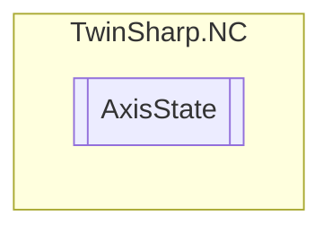

# AxisState `Public class`

## Description
Represents the state of an NC axis. 
            Provides access to various properties and methods to read and manipulate 
            the state of the axis, including position, velocity, acceleration, torque, 
            and error codes.

## Diagram


## Members
### Properties
#### Public  properties
| Type | Name | Methods |
| --- | --- | --- |
| `double` | [`ActualAcceleration`](#actualacceleration)<br>Optional: Actual acceleration "ActAcc" | `get` |
| `double` | [`ActualPosition`](#actualposition)<br>Actual position (charge with actual position compensation value) ("ActPos") | `get` |
| `double` | [`ActualPositionModulo`](#actualpositionmodulo)<br>Modulo actual position "ActPosModulo" | `get` |
| `int` | [`ActualRotationModulo`](#actualrotationmodulo)<br>Modulo actual rotation | `get` |
| `double` | [`ActualVelocity`](#actualvelocity)<br>Optional: Actual velocity "ActVelo" | `get` |
| `uint` | [`CouplingState`](#couplingstate)<br>Coupling state | `get` |
| `uint` | [`CouplingTableIndex`](#couplingtableindex)<br>Coupling table index | `get` |
| `uint` | [`CycleCounter`](#cyclecounter)<br>Set cycle counter<br>            (SAF timestamp) | `get` |
| `uint` | [`DelayedErrorCode`](#delayederrorcode)<br>Delayed error code (error pre-warning) in case of a delayed error reaction (see bit ErrorPropagationDelayed) | `get` |
| `uint` | [`ErrorCode`](#errorcode)<br>Axis state error code. | `get` |
| `double` | [`ExpectedTargetPosition`](#expectedtargetposition)<br>Expected target position | `get` |
| `uint` | [`InitializeCommandCounter`](#initializecommandcounter)<br>Counter for initialization command (InitializeCommandCounter) | `get` |
| `double` | [`LagErrorPeakMaximum`](#lagerrorpeakmaximum)<br>Peak hold value for maximum negative lag error of the position | `get` |
| `double` | [`LagErrorPeakMinimum`](#lagerrorpeakminimum)<br>Peak hold value for minimum positive lag error of the position | `get` |
| `double` | [`LagErrorPosition`](#lagerrorposition)<br>Lag error position(without dead time compensation) | `get` |
| `double` | [`LagErrorPositionWithDeadTimeCompensation`](#lagerrorpositionwithdeadtimecompensation)<br>Lag error position(with dead time compensation) "PosDiff" | `get` |
| [`NCAXISSTATE_ONLINESTRUCT`](./NCAXISSTATE_ONLINESTRUCT.md) | [`OnlineData`](#onlinedata)<br>The online data of the axis. | `get` |
| `double` | [`PositioningTimeLastMotionCommand`](#positioningtimelastmotioncommand)<br>Positioning time of the last motion command<br>            (start → target position window) | `get` |
| `double` | [`RemainingTravelDistance`](#remainingtraveldistance)<br>Remaining travel distance e.g. mm (SERVO). | `get` |
| `double` | [`RemaniningTravelTime`](#remaniningtraveltime)<br>Remaining travel time seconds (SERVO). | `get` |
| `uint` | [`ResetCommandCounter`](#resetcommandcounter)<br>Counter for reset command (ResetCommandCounter) | `get` |
| `double` | [`SetAcceleration`](#setacceleration)<br>Set acceleration | `get` |
| `int` | [`SetCommandNumber`](#setcommandnumber)<br>Set command number ("CmdNo") | `get` |
| `double` | [`SetCouplingFactor`](#setcouplingfactor)<br>Set coupling factor (set gear ratio) | `get` |
| `double` | [`SetJerk`](#setjerk)<br>Set jerk (time derivative of the set acceleration) | `get` |
| `int` | [`SetModuloRotation`](#setmodulorotation)<br>Modulo set rotation | `get` |
| `double` | [`SetPosition`](#setposition)<br>Set position | `get` |
| `double` | [`SetPositionModulo`](#setpositionmodulo)<br>Modulo set position | `get` |
| `double` | [`SetTorque`](#settorque)<br>Set torque (rot. motor) or set force(linear motor) ("SetTorque") | `get` |
| `double` | [`SetTorqueChange`](#settorquechange)<br>Set torque change (rot. motor) or set force change (linear motor) (time derivative of the set torque or set force) | `get` |
| `double` | [`SetTravelDirection`](#settraveldirection)<br>Set travel direction [-1.0, 0.0, 1.0] | `get` |
| `double` | [`SetVelocity`](#setvelocity)<br>Set velocity | `get` |
| `double` | [`SetVelocityOverride`](#setvelocityoverride)<br>Set override value for velocity [0.0…1.0] 1.0=100% | `get` |
| `double` | [`TorqueOffset`](#torqueoffset)<br>Additive set torque (rot. motor) or additive set force (linear motor) for pre-control.<br>            ("TorqueOffset") | `get, set` |
| `double` | [`UncorrectedSetAcceleration`](#uncorrectedsetacceleration)<br>Uncorrected set acceleration e.g. mm/s^2 | `get` |
| `double` | [`UncorrectedSetPosition`](#uncorrectedsetposition)<br>Uncorrected set position | `get` |
| `double` | [`UncorrectedSetTravelDirection`](#uncorrectedsettraveldirection)<br>Uncorrected set travel direction [-1.0, 0.0, 1.0] | `get` |
| `double` | [`UncorrectedSetVelocity`](#uncorrectedsetvelocity)<br>Uncorrected set velocity e.g. mm/s | `get` |

## Details
### Summary
Represents the state of an NC axis. 
            Provides access to various properties and methods to read and manipulate 
            the state of the axis, including position, velocity, acceleration, torque, 
            and error codes.

### Constructors
#### AxisState
[*Source code*](https://github.com///blob//TwinSharp/NC/AxisState.cs#L20)
```csharp
internal AxisState(AdsClient client, uint id)
```
##### Arguments
| Type | Name | Description |
| --- | --- | --- |
| `AdsClient` | client |   |
| `uint` | id |   |

### Properties
#### OnlineData
```csharp
public NCAXISSTATE_ONLINESTRUCT OnlineData { get; }
```
##### Summary
The online data of the axis.

#### ErrorCode
```csharp
public uint ErrorCode { get; }
```
##### Summary
Axis state error code.

#### CycleCounter
```csharp
public uint CycleCounter { get; }
```
##### Summary
Set cycle counter
            (SAF timestamp)

#### SetPosition
```csharp
public double SetPosition { get; }
```
##### Summary
Set position

#### SetPositionModulo
```csharp
public double SetPositionModulo { get; }
```
##### Summary
Modulo set position

#### SetModuloRotation
```csharp
public int SetModuloRotation { get; }
```
##### Summary
Modulo set rotation

#### SetTravelDirection
```csharp
public double SetTravelDirection { get; }
```
##### Summary
Set travel direction [-1.0, 0.0, 1.0]

#### SetVelocity
```csharp
public double SetVelocity { get; }
```
##### Summary
Set velocity

#### SetAcceleration
```csharp
public double SetAcceleration { get; }
```
##### Summary
Set acceleration

#### SetJerk
```csharp
public double SetJerk { get; }
```
##### Summary
Set jerk (time derivative of the set acceleration)

#### SetTorque
```csharp
public double SetTorque { get; }
```
##### Summary
Set torque (rot. motor) or set force(linear motor) ("SetTorque")

#### SetCouplingFactor
```csharp
public double SetCouplingFactor { get; }
```
##### Summary
Set coupling factor (set gear ratio)

#### ExpectedTargetPosition
```csharp
public double ExpectedTargetPosition { get; }
```
##### Summary
Expected target position

#### RemainingTravelDistance
```csharp
public double RemainingTravelDistance { get; }
```
##### Summary
Remaining travel distance e.g. mm (SERVO).

#### RemaniningTravelTime
```csharp
public double RemaniningTravelTime { get; }
```
##### Summary
Remaining travel time seconds (SERVO).

#### SetCommandNumber
```csharp
public int SetCommandNumber { get; }
```
##### Summary
Set command number ("CmdNo")

#### PositioningTimeLastMotionCommand
```csharp
public double PositioningTimeLastMotionCommand { get; }
```
##### Summary
Positioning time of the last motion command
            (start → target position window)

#### SetVelocityOverride
```csharp
public double SetVelocityOverride { get; }
```
##### Summary
Set override value for velocity [0.0…1.0] 1.0=100%

#### UncorrectedSetPosition
```csharp
public double UncorrectedSetPosition { get; }
```
##### Summary
Uncorrected set position

#### UncorrectedSetTravelDirection
```csharp
public double UncorrectedSetTravelDirection { get; }
```
##### Summary
Uncorrected set travel direction [-1.0, 0.0, 1.0]

#### UncorrectedSetVelocity
```csharp
public double UncorrectedSetVelocity { get; }
```
##### Summary
Uncorrected set velocity e.g. mm/s

#### UncorrectedSetAcceleration
```csharp
public double UncorrectedSetAcceleration { get; }
```
##### Summary
Uncorrected set acceleration e.g. mm/s^2

#### CouplingState
```csharp
public uint CouplingState { get; }
```
##### Summary
Coupling state

#### CouplingTableIndex
```csharp
public uint CouplingTableIndex { get; }
```
##### Summary
Coupling table index

#### DelayedErrorCode
```csharp
public uint DelayedErrorCode { get; }
```
##### Summary
Delayed error code (error pre-warning) in case of a delayed error reaction (see bit ErrorPropagationDelayed)

#### InitializeCommandCounter
```csharp
public uint InitializeCommandCounter { get; }
```
##### Summary
Counter for initialization command (InitializeCommandCounter)

#### ResetCommandCounter
```csharp
public uint ResetCommandCounter { get; }
```
##### Summary
Counter for reset command (ResetCommandCounter)

#### SetTorqueChange
```csharp
public double SetTorqueChange { get; }
```
##### Summary
Set torque change (rot. motor) or set force change (linear motor) (time derivative of the set torque or set force)

#### TorqueOffset
```csharp
public double TorqueOffset { get; set; }
```
##### Summary
Additive set torque (rot. motor) or additive set force (linear motor) for pre-control.
            ("TorqueOffset")

#### ActualPosition
```csharp
public double ActualPosition { get; }
```
##### Summary
Actual position (charge with actual position compensation value) ("ActPos")

#### ActualPositionModulo
```csharp
public double ActualPositionModulo { get; }
```
##### Summary
Modulo actual position "ActPosModulo"

#### ActualRotationModulo
```csharp
public int ActualRotationModulo { get; }
```
##### Summary
Modulo actual rotation

#### ActualVelocity
```csharp
public double ActualVelocity { get; }
```
##### Summary
Optional: Actual velocity "ActVelo"

#### ActualAcceleration
```csharp
public double ActualAcceleration { get; }
```
##### Summary
Optional: Actual acceleration "ActAcc"

#### LagErrorPosition
```csharp
public double LagErrorPosition { get; }
```
##### Summary
Lag error position(without dead time compensation)

#### LagErrorPositionWithDeadTimeCompensation
```csharp
public double LagErrorPositionWithDeadTimeCompensation { get; }
```
##### Summary
Lag error position(with dead time compensation) "PosDiff"

#### LagErrorPeakMaximum
```csharp
public double LagErrorPeakMaximum { get; }
```
##### Summary
Peak hold value for maximum negative lag error of the position

#### LagErrorPeakMinimum
```csharp
public double LagErrorPeakMinimum { get; }
```
##### Summary
Peak hold value for minimum positive lag error of the position

*Generated with* [*ModularDoc*](https://github.com/hailstorm75/ModularDoc)
