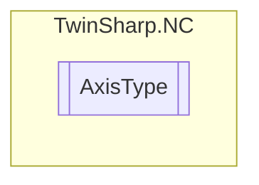

# AxisType `Public enum`

## Diagram

## Details
### Fields
#### NOT_DEFINED

#### ContinousAxisServo

#### DiscreteAxisHighLow

#### ContinousAxisStepper

#### EncoderAxis

#### ContinousAxisPositionPressureControl

#### TimeBaseGenerator

*Generated with* [*ModularDoc*](https://github.com/hailstorm75/ModularDoc)
