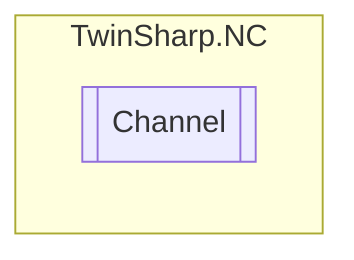

# Channel `Public class`

## Description
Represents a channel in the TwinCAT NC system.

## Diagram


## Members
### Properties
#### Public  properties
| Type | Name | Methods |
| --- | --- | --- |
| [`ChannelCyclicProcessData`](./ChannelCyclicProcessData.md) | [`CyclicProcessData`](#cyclicprocessdata)<br>Gets the cyclic process data of the channel. | `get, private set` |
| [`ChannelFunctions`](./ChannelFunctions.md) | [`Functions`](#functions)<br>Gets the channel functions. | `get, private set` |
| [`ChannelParameters`](./ChannelParameters.md) | [`Parameters`](#parameters)<br>Gets the channel parameters. | `get, private set` |
| [`ChannelState`](./ChannelState.md) | [`State`](#state)<br>Gets the channel state. | `get, private set` |

## Details
### Summary
Represents a channel in the TwinCAT NC system.

### Constructors
#### Channel
[*Source code*](https://github.com///blob//TwinSharp/NC/Channel.cs#L15)
```csharp
public Channel(AdsClient client, uint id)
```
##### Arguments
| Type | Name | Description |
| --- | --- | --- |
| `AdsClient` | client | The ADS client connected to the target. |
| `uint` | id | The channel ID. |

##### Summary
Initializes a new instance of the [Channel](twinsharp/nc/Channel.md) class.

### Properties
#### Parameters
```csharp
public ChannelParameters Parameters { get; private set; }
```
##### Summary
Gets the channel parameters.

#### State
```csharp
public ChannelState State { get; private set; }
```
##### Summary
Gets the channel state.

#### Functions
```csharp
public ChannelFunctions Functions { get; private set; }
```
##### Summary
Gets the channel functions.

#### CyclicProcessData
```csharp
public ChannelCyclicProcessData CyclicProcessData { get; private set; }
```
##### Summary
Gets the cyclic process data of the channel.

*Generated with* [*ModularDoc*](https://github.com/hailstorm75/ModularDoc)
