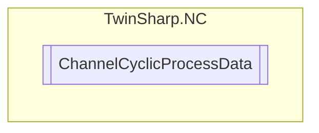

# ChannelCyclicProcessData `Public class`

## Diagram


## Members
### Properties
#### Public  properties
| Type | Name | Methods |
| --- | --- | --- |
| `uint` | [`SpeedOverrideChannel`](#speedoverridechannel)<br>Speed override channel (Axis in the Channel).<br>            1000000 = 100% | `get, set` |
| `uint` | [`SpeedOverrideSpindle`](#speedoverridespindle)<br>Speed override spindle.<br>            1000000 = 100% | `get, set` |

## Details
### Constructors
#### ChannelCyclicProcessData
[*Source code*](https://github.com///blob//TwinSharp/NC/ChannelCyclicProcessData.cs#L11)
```csharp
internal ChannelCyclicProcessData(AdsClient client, uint id)
```
##### Arguments
| Type | Name | Description |
| --- | --- | --- |
| `AdsClient` | client |   |
| `uint` | id |   |

### Properties
#### SpeedOverrideChannel
```csharp
public uint SpeedOverrideChannel { get; set; }
```
##### Summary
Speed override channel (Axis in the Channel).
            1000000 = 100%

#### SpeedOverrideSpindle
```csharp
public uint SpeedOverrideSpindle { get; set; }
```
##### Summary
Speed override spindle.
            1000000 = 100%

*Generated with* [*ModularDoc*](https://github.com/hailstorm75/ModularDoc)
