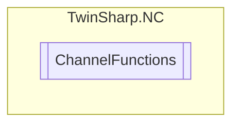

# ChannelFunctions `Public class`

## Description
The ChannelFunctions class provides methods to interact with and control NC (Numerical Control) channels
            using an AdsClient. It allows loading NC programs by number or name, starting the interpreter, setting
            the interpreter operation mode, setting paths for subroutines, and controlling the channel with reset,
            stop, retry, and skip functionalities.

## Diagram


## Members
### Methods
#### Public  methods
| Returns | Name |
| --- | --- |
| `void` | [`LoadProgramByName`](#loadprogrambyname)(`string` programName)<br>Load NC program by name. The standard NC path does not have to be given although it may. Other paths are also permitted. |
| `void` | [`LoadProgramByNumber`](#loadprogrambynumber)(`uint` programNumber)<br>Load NC program with program number |
| `void` | [`ResetChannel`](#resetchannel)()<br>Reset channel |
| `void` | [`RetryChannel`](#retrychannel)()<br>"Retry" Channel(restart Channel) |
| `void` | [`SetInterpreterOperationMode`](#setinterpreteroperationmode)([`InterpreterOperationMode`](./InterpreterOperationMode.md) mode)<br>Set the interpreter/channel operation mode |
| `void` | [`SetPathForSubRoutines`](#setpathforsubroutines)(`string` path)<br>Set the path for subroutines |
| `void` | [`SkipChannel`](#skipchannel)()<br>"Skip" Channel (skip task/block) |
| `void` | [`StartInterpreter`](#startinterpreter)()<br>Start interpreter |
| `void` | [`StopChannel`](#stopchannel)()<br>Stop channel |

## Details
### Summary
The ChannelFunctions class provides methods to interact with and control NC (Numerical Control) channels
            using an AdsClient. It allows loading NC programs by number or name, starting the interpreter, setting
            the interpreter operation mode, setting paths for subroutines, and controlling the channel with reset,
            stop, retry, and skip functionalities.

### Constructors
#### ChannelFunctions
[*Source code*](https://github.com///blob//TwinSharp/NC/ChannelFunctions.cs#L16)
```csharp
internal ChannelFunctions(AdsClient client, uint id)
```
##### Arguments
| Type | Name | Description |
| --- | --- | --- |
| `AdsClient` | client |   |
| `uint` | id |   |

### Methods
#### LoadProgramByNumber
[*Source code*](https://github.com///blob//TwinSharp/NC/ChannelFunctions.cs#L27)
```csharp
public void LoadProgramByNumber(uint programNumber)
```
##### Arguments
| Type | Name | Description |
| --- | --- | --- |
| `uint` | programNumber |  |

##### Summary
Load NC program with program number

#### StartInterpreter
[*Source code*](https://github.com///blob//TwinSharp/NC/ChannelFunctions.cs#L35)
```csharp
public void StartInterpreter()
```
##### Summary
Start interpreter

#### LoadProgramByName
[*Source code*](https://github.com///blob//TwinSharp/NC/ChannelFunctions.cs#L44)
```csharp
public void LoadProgramByName(string programName)
```
##### Arguments
| Type | Name | Description |
| --- | --- | --- |
| `string` | programName |  |

##### Summary
Load NC program by name. The standard NC path does not have to be given although it may. Other paths are also permitted.

#### SetInterpreterOperationMode
[*Source code*](https://github.com///blob//TwinSharp/NC/ChannelFunctions.cs#L53)
```csharp
public void SetInterpreterOperationMode(InterpreterOperationMode mode)
```
##### Arguments
| Type | Name | Description |
| --- | --- | --- |
| [`InterpreterOperationMode`](./InterpreterOperationMode.md) | mode |  |

##### Summary
Set the interpreter/channel operation mode

#### SetPathForSubRoutines
[*Source code*](https://github.com///blob//TwinSharp/NC/ChannelFunctions.cs#L62)
```csharp
public void SetPathForSubRoutines(string path)
```
##### Arguments
| Type | Name | Description |
| --- | --- | --- |
| `string` | path |  |

##### Summary
Set the path for subroutines

#### ResetChannel
[*Source code*](https://github.com///blob//TwinSharp/NC/ChannelFunctions.cs#L70)
```csharp
public void ResetChannel()
```
##### Summary
Reset channel

#### StopChannel
[*Source code*](https://github.com///blob//TwinSharp/NC/ChannelFunctions.cs#L78)
```csharp
public void StopChannel()
```
##### Summary
Stop channel

#### RetryChannel
[*Source code*](https://github.com///blob//TwinSharp/NC/ChannelFunctions.cs#L86)
```csharp
public void RetryChannel()
```
##### Summary
"Retry" Channel(restart Channel)

#### SkipChannel
[*Source code*](https://github.com///blob//TwinSharp/NC/ChannelFunctions.cs#L94)
```csharp
public void SkipChannel()
```
##### Summary
"Skip" Channel (skip task/block)

*Generated with* [*ModularDoc*](https://github.com/hailstorm75/ModularDoc)
