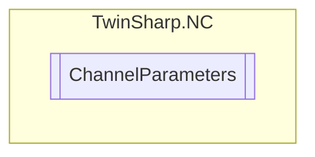

# ChannelParameters `Public class`

## Description
Represents the parameters of a channel in the TwinCAT NC system.
            This class provides properties to access various channel parameters such as ID, Name, Type, InterpreterType, 
            ProgramLoadBufferSize, ProgramNumberJobList, InterpolationLoadLogMode, InterpolationTraceMode, 
            RecordAllFeederEntries, NcLoggerLevel, G70Factor, G71Factor, ActivationOfDefaultGcode, and GroupId.
            These properties interact with the TwinCAT ADS client to read and write the respective values.

## Diagram


## Members
### Properties
#### Public  properties
| Type | Name | Methods |
| --- | --- | --- |
| `ushort` | [`ActivationOfDefaultGcode`](#activationofdefaultgcode)<br>Activation of default G-code. 0/1 default: FALSE | `get, set` |
| `double` | [`G70Factor`](#g70factor)<br>Factor for G70. | `get, set` |
| `double` | [`G71Factor`](#g71factor)<br>Factor for G71. | `get, set` |
| `uint` | [`GroupId`](#groupid)<br>Group ID (only explicit for 3D and FIFO channel) | `get` |
| `uint` | [`ID`](#id)<br>Channel ID | `get` |
| [`InterpolationLoadLogMode`](./InterpolationLoadLogMode.md) | [`InterpolationLoadLogMode`](#interpolationloadlogmode)<br>Load log mode | `get, set` |
| [`InterpolationTraceMode`](./InterpolationTraceMode.md) | [`InterpolationTraceMode`](#interpolationtracemode)<br>Trace mode | `get, set` |
| [`InterpreterType`](./InterpreterType.md) | [`InterpreterType`](#interpretertype)<br>Interpreter type | `get` |
| `string` | [`Name`](#name)<br>Channel name | `get` |
| `uint` | [`NcLoggerLevel`](#ncloggerlevel)<br>Channel specific level for NC logger messages 0: errors only 1: all NC messages | `get, set` |
| `uint` | [`ProgramLoadBufferSize`](#programloadbuffersize)<br>Program load buffer size in bytes | `get` |
| `uint` | [`ProgramNumberJobList`](#programnumberjoblist)<br>Program no. according to job list | `get` |
| `uint` | [`RecordAllFeederEntries`](#recordallfeederentries)<br>Records all feeder entries in a log file named "TcNci.log" | `get, set` |
| [`ChannelType`](./ChannelType.md) | [`Type`](#type)<br>Channel type | `get` |

## Details
### Summary
Represents the parameters of a channel in the TwinCAT NC system.
            This class provides properties to access various channel parameters such as ID, Name, Type, InterpreterType, 
            ProgramLoadBufferSize, ProgramNumberJobList, InterpolationLoadLogMode, InterpolationTraceMode, 
            RecordAllFeederEntries, NcLoggerLevel, G70Factor, G71Factor, ActivationOfDefaultGcode, and GroupId.
            These properties interact with the TwinCAT ADS client to read and write the respective values.

### Constructors
#### ChannelParameters
[*Source code*](https://github.com///blob//TwinSharp/NC/ChannelParameters.cs#L17)
```csharp
internal ChannelParameters(AdsClient client, uint id)
```
##### Arguments
| Type | Name | Description |
| --- | --- | --- |
| `AdsClient` | client |   |
| `uint` | id |   |

### Properties
#### ID
```csharp
public uint ID { get; }
```
##### Summary
Channel ID

#### Name
```csharp
public string Name { get; }
```
##### Summary
Channel name

#### Type
```csharp
public ChannelType Type { get; }
```
##### Summary
Channel type

#### InterpreterType
```csharp
public InterpreterType InterpreterType { get; }
```
##### Summary
Interpreter type

#### ProgramLoadBufferSize
```csharp
public uint ProgramLoadBufferSize { get; }
```
##### Summary
Program load buffer size in bytes

#### ProgramNumberJobList
```csharp
public uint ProgramNumberJobList { get; }
```
##### Summary
Program no. according to job list

#### InterpolationLoadLogMode
```csharp
public InterpolationLoadLogMode InterpolationLoadLogMode { get; set; }
```
##### Summary
Load log mode

#### InterpolationTraceMode
```csharp
public InterpolationTraceMode InterpolationTraceMode { get; set; }
```
##### Summary
Trace mode

#### RecordAllFeederEntries
```csharp
public uint RecordAllFeederEntries { get; set; }
```
##### Summary
Records all feeder entries in a log file named "TcNci.log"

#### NcLoggerLevel
```csharp
public uint NcLoggerLevel { get; set; }
```
##### Summary
Channel specific level for NC logger messages 0: errors only 1: all NC messages

#### G70Factor
```csharp
public double G70Factor { get; set; }
```
##### Summary
Factor for G70.

#### G71Factor
```csharp
public double G71Factor { get; set; }
```
##### Summary
Factor for G71.

#### ActivationOfDefaultGcode
```csharp
public ushort ActivationOfDefaultGcode { get; set; }
```
##### Summary
Activation of default G-code. 0/1 default: FALSE

#### GroupId
```csharp
public uint GroupId { get; }
```
##### Summary
Group ID (only explicit for 3D and FIFO channel)

*Generated with* [*ModularDoc*](https://github.com/hailstorm75/ModularDoc)
