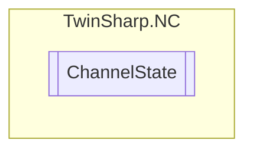

# ChannelState `Public class`

## Description
Represents the state of an NC (Numerical Control) channel, providing access to various channel properties such as error codes, group count, interpreter state, operation mode, and program information using an AdsClient.

## Diagram


## Members
### Properties
#### Public  properties
| Type | Name | Methods |
| --- | --- | --- |
| `string` | [`CurrentLoadedProgramName`](#currentloadedprogramname)<br>Program name of currently loaded program<br>            (100 characters, null-terminated) | `get` |
| `uint` | [`CurrentLoadedProgramNumber`](#currentloadedprogramnumber)<br>Current loaded program number | `get` |
| `int` | [`ErrorCode`](#errorcode)<br>Error code Channel | `get` |
| `uint` | [`GroupCount`](#groupcount)<br>Number of groups in the Channel | `get` |
| [`InterpreterOperationMode`](./InterpreterOperationMode.md) | [`InterpreterOperationMode`](#interpreteroperationmode)<br>Interpreter/channel operation mode | `get` |
| `uint` | [`InterpreterSimulationMode`](#interpretersimulationmode)<br>Interpreter simulation mode 0: off (default) 1: on | `get` |
| [`InterpreterState`](./InterpreterState.md) | [`InterpreterState`](#interpreterstate)<br>Interpreter status | `get` |
| `uint` | [`TextIndex`](#textindex)<br>If the interpreter is in the aborted state, the current text index can be read out here | `get` |

## Details
### Summary
Represents the state of an NC (Numerical Control) channel, providing access to various channel properties such as error codes, group count, interpreter state, operation mode, and program information using an AdsClient.

### Constructors
#### ChannelState
[*Source code*](https://github.com///blob//TwinSharp/NC/ChannelState.cs#L13)
```csharp
internal ChannelState(AdsClient client, uint id)
```
##### Arguments
| Type | Name | Description |
| --- | --- | --- |
| `AdsClient` | client |   |
| `uint` | id |   |

### Properties
#### ErrorCode
```csharp
public int ErrorCode { get; }
```
##### Summary
Error code Channel

#### GroupCount
```csharp
public uint GroupCount { get; }
```
##### Summary
Number of groups in the Channel

#### InterpreterState
```csharp
public InterpreterState InterpreterState { get; }
```
##### Summary
Interpreter status

#### InterpreterOperationMode
```csharp
public InterpreterOperationMode InterpreterOperationMode { get; }
```
##### Summary
Interpreter/channel operation mode

#### CurrentLoadedProgramNumber
```csharp
public uint CurrentLoadedProgramNumber { get; }
```
##### Summary
Current loaded program number

#### CurrentLoadedProgramName
```csharp
public string CurrentLoadedProgramName { get; }
```
##### Summary
Program name of currently loaded program
            (100 characters, null-terminated)

#### InterpreterSimulationMode
```csharp
public uint InterpreterSimulationMode { get; }
```
##### Summary
Interpreter simulation mode 0: off (default) 1: on

#### TextIndex
```csharp
public uint TextIndex { get; }
```
##### Summary
If the interpreter is in the aborted state, the current text index can be read out here

*Generated with* [*ModularDoc*](https://github.com/hailstorm75/ModularDoc)
