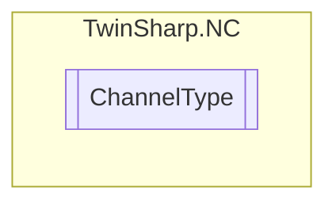

# ChannelType `Public enum`

## Diagram

## Details
### Fields
#### Standard

#### Interpreter

#### FIFO

#### KinematicTransformation

*Generated with* [*ModularDoc*](https://github.com/hailstorm75/ModularDoc)
