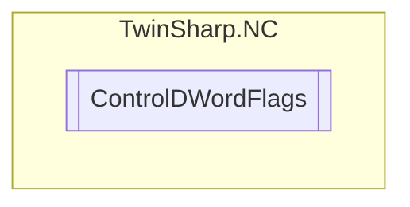

# ControlDWordFlags `Public enum`

## Diagram

## Details
### Fields
#### None

#### PositionAreaMonitoring

#### TargetPositionMonitoring

#### LoopMode

#### MotionMonitoring

#### PEHTimeMonitoring

#### BacklashCompensation

#### DelayedErrorReaction

#### ModuloPositioning

#### SimulationAxis

#### Unused1

#### Unused2

#### Unused3

#### StopMonitoring

#### Unused4

#### Unused5

#### Unused6

#### PositionLagMonitoring

#### VeloLagMonitoring

#### SoftLimitMinMonitoring

#### SoftLimitMaxMonitoring

#### PositionCorrection

#### AllowSlaveCommands

#### AllowExtSetAxisCommands

#### NcApplicationRequested

*Generated with* [*ModularDoc*](https://github.com/hailstorm75/ModularDoc)
