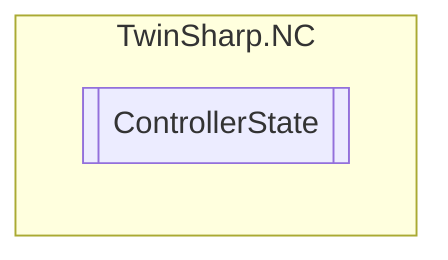

# ControllerState `Public class`

## Diagram


## Members
### Properties
#### Public  properties
| Type | Name | Methods |
| --- | --- | --- |
| `int` | [`ErrorState`](#errorstate)<br>Error state controller | `get` |
| `double` | [`OutputAbsoluteUnits`](#outputabsoluteunits)<br>Controller output in absolute units.<br>            Base Unit / s<br>            Symbolic access possible "CtrlOutput". | `get` |
| `double` | [`OutputPercent`](#outputpercent)<br>Controller output in percent | `get` |
| `double` | [`OutputVolts`](#outputvolts)<br>Controller output in volts | `get` |

## Details
### Constructors
#### ControllerState
[*Source code*](https://github.com///blob//TwinSharp/NC/ControllerState.cs#L10)
```csharp
internal ControllerState(AdsClient client, uint id)
```
##### Arguments
| Type | Name | Description |
| --- | --- | --- |
| `AdsClient` | client |   |
| `uint` | id |   |

### Properties
#### ErrorState
```csharp
public int ErrorState { get; }
```
##### Summary
Error state controller

#### OutputAbsoluteUnits
```csharp
public double OutputAbsoluteUnits { get; }
```
##### Summary
Controller output in absolute units.
            Base Unit / s
            Symbolic access possible "CtrlOutput".

#### OutputPercent
```csharp
public double OutputPercent { get; }
```
##### Summary
Controller output in percent

#### OutputVolts
```csharp
public double OutputVolts { get; }
```
##### Summary
Controller output in volts

*Generated with* [*ModularDoc*](https://github.com/hailstorm75/ModularDoc)
