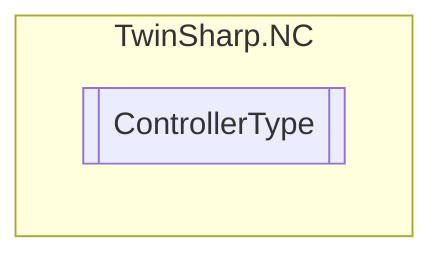

# ControllerType `Public enum`

## Diagram

## Details
### Fields
#### NOT_DEFINED

#### P_ControllerPosition

#### PP_Controller

#### PID_Controller

#### P_ControllerVelocity

#### PI_ControllerVelocity

#### High_LowSpeedController

#### StepperMotorController

#### SercosController

#### TComController

*Generated with* [*ModularDoc*](https://github.com/hailstorm75/ModularDoc)
