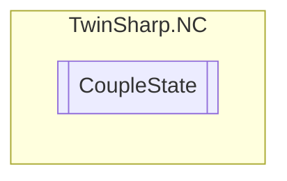

# CoupleState `Public enum`

## Description
Coupling state of the axis

## Diagram

## Details
### Summary
Coupling state of the axis

### Fields
#### Single
##### Summary
Single axis that is neither a master nor a slave (SINGLE)

#### Master
##### Summary
Master axis with any number of slaves (MASTER)

#### MasterSlave
##### Summary
Slave axis that is the master of another another slave (MASTERSLAVE)

#### Slave
##### Summary
Just a slave axis (SLAVE)

*Generated with* [*ModularDoc*](https://github.com/hailstorm75/ModularDoc)
