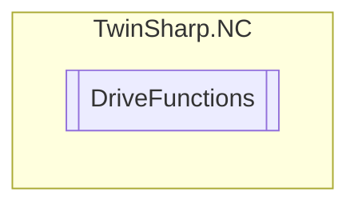

# DriveFunctions `Public class`

## Diagram


## Members
### Methods
#### Public  methods
| Returns | Name |
| --- | --- |
| `void` | [`RemoveAndDeleteCharacteristicDriveTable`](#removeanddeletecharacteristicdrivetable)(`ulong` tableId) |

## Details
### Constructors
#### DriveFunctions
[*Source code*](https://github.com///blob//TwinSharp/NC/DriveFunctions.cs#L10)
```csharp
internal DriveFunctions(AdsClient client, uint id)
```
##### Arguments
| Type | Name | Description |
| --- | --- | --- |
| `AdsClient` | client |   |
| `uint` | id |   |

### Methods
#### RemoveAndDeleteCharacteristicDriveTable
[*Source code*](https://github.com///blob//TwinSharp/NC/DriveFunctions.cs#L17)
```csharp
public void RemoveAndDeleteCharacteristicDriveTable(ulong tableId)
```
##### Arguments
| Type | Name | Description |
| --- | --- | --- |
| `ulong` | tableId |   |

*Generated with* [*ModularDoc*](https://github.com/hailstorm75/ModularDoc)
