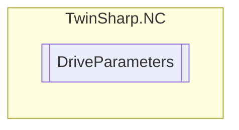

# DriveParameters `Public class`

## Diagram


## Members
### Properties
#### Public  properties
| Type | Name | Methods |
| --- | --- | --- |
| `uint` | [`ID`](#id) | `get` |
| `bool` | [`MotorPolarityInverted`](#motorpolarityinverted)<br>Writing is not allowed if the controller enable has been issued. | `get, set` |
| `string` | [`Name`](#name) | `get` |
| [`DriveType`](./DriveType.md) | [`Type`](#type) | `get` |

## Details
### Constructors
#### DriveParameters
[*Source code*](https://github.com///blob//TwinSharp/NC/DriveParameters.cs#L10)
```csharp
internal DriveParameters(AdsClient client, uint id)
```
##### Arguments
| Type | Name | Description |
| --- | --- | --- |
| `AdsClient` | client |   |
| `uint` | id |   |

### Properties
#### ID
```csharp
public uint ID { get; }
```

#### Name
```csharp
public string Name { get; }
```

#### Type
```csharp
public DriveType Type { get; }
```

#### MotorPolarityInverted
```csharp
public bool MotorPolarityInverted { get; set; }
```
##### Summary
Writing is not allowed if the controller enable has been issued.

*Generated with* [*ModularDoc*](https://github.com/hailstorm75/ModularDoc)
