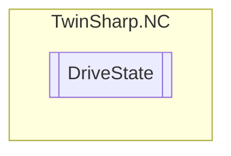

# DriveState `Public class`

## Diagram


## Members
### Properties
#### Public  properties
| Type | Name | Methods |
| --- | --- | --- |
| `int` | [`ErrorState`](#errorstate) | `get` |
| `double` | [`TotalOutputAbsoluteUnits`](#totaloutputabsoluteunits)<br>Total output in absolute units.<br>            Base unit / s <br>            Symbolic access possible: "DriveOutput" | `get` |
| `double` | [`TotalOutputPercent`](#totaloutputpercent)<br>Total output in percent. | `get` |
| `double` | [`TotalOutputVolts`](#totaloutputvolts)<br>Total output in volts. | `get` |

## Details
### Constructors
#### DriveState
[*Source code*](https://github.com///blob//TwinSharp/NC/DriveState.cs#L10)
```csharp
internal DriveState(AdsClient client, uint id)
```
##### Arguments
| Type | Name | Description |
| --- | --- | --- |
| `AdsClient` | client |   |
| `uint` | id |   |

### Properties
#### ErrorState
```csharp
public int ErrorState { get; }
```

#### TotalOutputAbsoluteUnits
```csharp
public double TotalOutputAbsoluteUnits { get; }
```
##### Summary
Total output in absolute units.
            Base unit / s 
            Symbolic access possible: "DriveOutput"

#### TotalOutputPercent
```csharp
public double TotalOutputPercent { get; }
```
##### Summary
Total output in percent.

#### TotalOutputVolts
```csharp
public double TotalOutputVolts { get; }
```
##### Summary
Total output in volts.

*Generated with* [*ModularDoc*](https://github.com/hailstorm75/ModularDoc)
