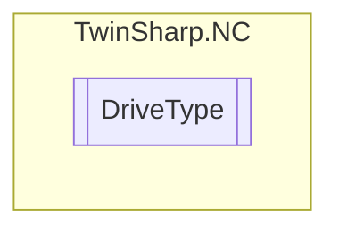

# DriveType `Public enum`

## Diagram

## Details
### Fields
#### NOT_DEFINED

#### M2400_DAC1

#### M2400_DAC2

#### M2400_DAC3

#### M2400_DAC4

#### KL4xxx

#### KL4xxx_NonLinear

#### Discete_TwoSpeed

#### Stepper

#### Sercos

#### KL5051

#### AX2000_B200

#### ProfilDrive

#### Universal

#### NcBackplane

#### CANopen_Lenze

#### CANopen_DS402_MDP742

#### AX2000_B900

#### KL2531_Stepper

#### KL2532_DC

#### TCOM

#### MDP_733

#### MDP_703

*Generated with* [*ModularDoc*](https://github.com/hailstorm75/ModularDoc)
