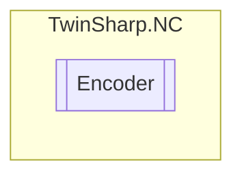

# Encoder `Public class`

## Diagram


## Details
### Constructors
#### Encoder
[*Source code*](https://github.com///blob//TwinSharp/NC/Encoder.cs#L11)
```csharp
internal Encoder(AdsClient client, uint id)
```
##### Arguments
| Type | Name | Description |
| --- | --- | --- |
| `AdsClient` | client |   |
| `uint` | id |   |

*Generated with* [*ModularDoc*](https://github.com/hailstorm75/ModularDoc)
