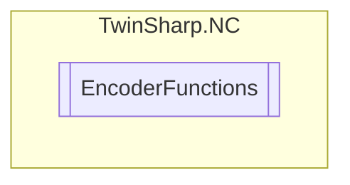

# EncoderFunctions `Public class`

## Diagram


## Members
### Methods
#### Public  methods
| Returns | Name |
| --- | --- |
| `void` | [`ActivateExternalLatchFallingEdge`](#activateexternallatchfallingedge)()<br>Activate  "External Latch" or activate "measuring probe function" (falling edge)<br>            KL5101,SERCOS,AX2xxx,PROFIDrive |
| `void` | [`ActivateExternalLatchFallingEdgeCANopen`](#activateexternallatchfallingedgecanopen)(`bool` latch1, `bool` latch2, `bool` latch3, `bool` latch4)<br>Activate  "External Latch" 1 to 4 or activate "measuring probe function" 1 to 4 (falling edge)<br>            CANopen |
| `void` | [`ActivateExternalLatchRisingEdge`](#activateexternallatchrisingedge)()<br>Activate  "External Latch" or activate "measuring probe function" (typically rising edge)<br>            KL5101,SERCOS,AX2xxx,PROFIDrive |
| `void` | [`ActivateExternalLatchRisingEdgeCANopen`](#activateexternallatchrisingedgecanopen)(`bool` latch1, `bool` latch2, `bool` latch3, `bool` latch4)<br>Activate  "External Latch" 1 to 4 or activate "measuring probe function" 1 to 4 (typically rising edge)<br>            CANopen |
| `void` | [`ActivateTouchProbe`](#activatetouchprobe)(`uint` probeUnit, [`SignalEdge`](./SignalEdge.md) signalEdge, [`ProbeMode`](./ProbeMode.md) probeMode, `uint` signalSource)<br>Function group "TouchProbeV2": SERCOS/SoE, EtherCAT/CoE(CANopen DS402), SoftDrive(TCom), MDP 511 (EL5101, EL5151, EL5021, EL7041, EL7342) |
| `void` | [`DeactivateExternalLatch`](#deactivateexternallatch)()<br>Deactivate "external latch" or deactivate "measuring probe function"<br>            KL5101,SERCOS,AX2xxx,PROFIDrive |
| `void` | [`DeactivateExternalLatchCANopen`](#deactivateexternallatchcanopen)(`bool` latch1, `bool` latch2, `bool` latch3, `bool` latch4)<br>Deactivate "external latch" or deactivate "measuring probe function"<br>            CANopen |
| `void` | [`DeactivateTouchProbe`](#deactivatetouchprobe)(`uint` probeUnit, [`SignalEdge`](./SignalEdge.md) signalEdge)<br>Deactivate "touch probe" (external latch)<br>            Function group "TouchProbeV2": SERCOS/SoE, EtherCAT/CoE(CANopen DS402), SoftDrive(TCom), MDP 511 (EL5101, EL5151, EL5021, EL7041, EL7342) |
| `void` | [`ReInitActualEncoderPosition`](#reinitactualencoderposition)()<br>Re-initialization of the actual encoder position.<br>            Note: Takes effect for reference system „ABSOLUTE MULTITURN RANGE(with single overflow)“ and „ABSOLUTE SINGLETURN RANGE(with single overflow)“.<br>            NEW from TC3 |
| `void` | [`SetActualPosition`](#setactualposition)([`ActualPositionType`](./ActualPositionType.md) actualPositionType, `double` position)<br>Set actual position encoder/axis. Caution when using! |
| `void` | [`SetExternalLatchEvent`](#setexternallatchevent)(`double` position)<br>Set "External latch event" and "External latch position"<br>            KL5101,SERCOS,AX2xxx,PROFIDrive <br>            Only for EtherCAT. |

## Details
### Constructors
#### EncoderFunctions
[*Source code*](https://github.com///blob//TwinSharp/NC/EncoderFunctions.cs#L10)
```csharp
internal EncoderFunctions(AdsClient client, uint id)
```
##### Arguments
| Type | Name | Description |
| --- | --- | --- |
| `AdsClient` | client |   |
| `uint` | id |   |

### Methods
#### SetActualPosition
[*Source code*](https://github.com///blob//TwinSharp/NC/EncoderFunctions.cs#L22)
```csharp
public void SetActualPosition(ActualPositionType actualPositionType, double position)
```
##### Arguments
| Type | Name | Description |
| --- | --- | --- |
| [`ActualPositionType`](./ActualPositionType.md) | actualPositionType |  |
| `double` | position |  |

##### Summary
Set actual position encoder/axis. Caution when using!

#### ReInitActualEncoderPosition
[*Source code*](https://github.com///blob//TwinSharp/NC/EncoderFunctions.cs#L39)
```csharp
public void ReInitActualEncoderPosition()
```
##### Summary
Re-initialization of the actual encoder position.
            Note: Takes effect for reference system „ABSOLUTE MULTITURN RANGE(with single overflow)“ and „ABSOLUTE SINGLETURN RANGE(with single overflow)“.
            NEW from TC3

#### ActivateTouchProbe
[*Source code*](https://github.com///blob//TwinSharp/NC/EncoderFunctions.cs#L51)
```csharp
public void ActivateTouchProbe(uint probeUnit, SignalEdge signalEdge, ProbeMode probeMode, uint signalSource)
```
##### Arguments
| Type | Name | Description |
| --- | --- | --- |
| `uint` | probeUnit |  |
| [`SignalEdge`](./SignalEdge.md) | signalEdge |  |
| [`ProbeMode`](./ProbeMode.md) | probeMode |  |
| `uint` | signalSource |  |

##### Summary
Function group "TouchProbeV2": SERCOS/SoE, EtherCAT/CoE(CANopen DS402), SoftDrive(TCom), MDP 511 (EL5101, EL5151, EL5021, EL7041, EL7342)

#### ActivateExternalLatchRisingEdge
[*Source code*](https://github.com///blob//TwinSharp/NC/EncoderFunctions.cs#L70)
```csharp
public void ActivateExternalLatchRisingEdge()
```
##### Summary
Activate  "External Latch" or activate "measuring probe function" (typically rising edge)
            KL5101,SERCOS,AX2xxx,PROFIDrive

#### ActivateExternalLatchRisingEdgeCANopen
[*Source code*](https://github.com///blob//TwinSharp/NC/EncoderFunctions.cs#L83)
```csharp
public void ActivateExternalLatchRisingEdgeCANopen(bool latch1, bool latch2, bool latch3, bool latch4)
```
##### Arguments
| Type | Name | Description |
| --- | --- | --- |
| `bool` | latch1 |  |
| `bool` | latch2 |  |
| `bool` | latch3 |  |
| `bool` | latch4 |  |

##### Summary
Activate  "External Latch" 1 to 4 or activate "measuring probe function" 1 to 4 (typically rising edge)
            CANopen

#### ActivateExternalLatchFallingEdge
[*Source code*](https://github.com///blob//TwinSharp/NC/EncoderFunctions.cs#L100)
```csharp
public void ActivateExternalLatchFallingEdge()
```
##### Summary
Activate  "External Latch" or activate "measuring probe function" (falling edge)
            KL5101,SERCOS,AX2xxx,PROFIDrive

#### ActivateExternalLatchFallingEdgeCANopen
[*Source code*](https://github.com///blob//TwinSharp/NC/EncoderFunctions.cs#L113)
```csharp
public void ActivateExternalLatchFallingEdgeCANopen(bool latch1, bool latch2, bool latch3, bool latch4)
```
##### Arguments
| Type | Name | Description |
| --- | --- | --- |
| `bool` | latch1 |  |
| `bool` | latch2 |  |
| `bool` | latch3 |  |
| `bool` | latch4 |  |

##### Summary
Activate  "External Latch" 1 to 4 or activate "measuring probe function" 1 to 4 (falling edge)
            CANopen

#### DeactivateTouchProbe
[*Source code*](https://github.com///blob//TwinSharp/NC/EncoderFunctions.cs#L132)
```csharp
public void DeactivateTouchProbe(uint probeUnit, SignalEdge signalEdge)
```
##### Arguments
| Type | Name | Description |
| --- | --- | --- |
| `uint` | probeUnit |  |
| [`SignalEdge`](./SignalEdge.md) | signalEdge |  |

##### Summary
Deactivate "touch probe" (external latch)
            Function group "TouchProbeV2": SERCOS/SoE, EtherCAT/CoE(CANopen DS402), SoftDrive(TCom), MDP 511 (EL5101, EL5151, EL5021, EL7041, EL7342)

#### DeactivateExternalLatch
[*Source code*](https://github.com///blob//TwinSharp/NC/EncoderFunctions.cs#L151)
```csharp
public void DeactivateExternalLatch()
```
##### Summary
Deactivate "external latch" or deactivate "measuring probe function"
            KL5101,SERCOS,AX2xxx,PROFIDrive

#### DeactivateExternalLatchCANopen
[*Source code*](https://github.com///blob//TwinSharp/NC/EncoderFunctions.cs#L164)
```csharp
public void DeactivateExternalLatchCANopen(bool latch1, bool latch2, bool latch3, bool latch4)
```
##### Arguments
| Type | Name | Description |
| --- | --- | --- |
| `bool` | latch1 |  |
| `bool` | latch2 |  |
| `bool` | latch3 |  |
| `bool` | latch4 |  |

##### Summary
Deactivate "external latch" or deactivate "measuring probe function"
            CANopen

#### SetExternalLatchEvent
[*Source code*](https://github.com///blob//TwinSharp/NC/EncoderFunctions.cs#L182)
```csharp
public void SetExternalLatchEvent(double position)
```
##### Arguments
| Type | Name | Description |
| --- | --- | --- |
| `double` | position |   |

##### Summary
Set "External latch event" and "External latch position"
            KL5101,SERCOS,AX2xxx,PROFIDrive 
            Only for EtherCAT.

*Generated with* [*ModularDoc*](https://github.com/hailstorm75/ModularDoc)
