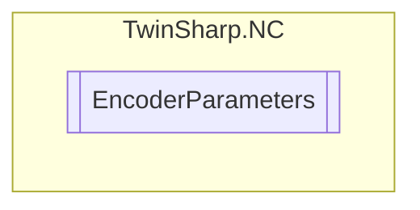

# EncoderParameters `Public class`

## Diagram


## Members
### Properties
#### Public  properties
| Type | Name | Methods |
| --- | --- | --- |
| `bool` | [`EncoderCountDirectionInverted`](#encodercountdirectioninverted) | `get, set` |
| `uint` | [`EncoderEvaluationDirection`](#encoderevaluationdirection) | `get, set` |
| `uint` | [`EncoderMode`](#encodermode) | `get, set` |
| `double` | [`FilterSecondsAcceleration`](#filtersecondsacceleration) | `get, set` |
| `double` | [`FilterSecondsPosition`](#filtersecondsposition) | `get, set` |
| `double` | [`FilterSecondsVelocity`](#filtersecondsvelocity) | `get, set` |
| `uint` | [`ID`](#id) | `get` |
| `double` | [`ModuloFactor`](#modulofactor) | `get, set` |
| `string` | [`Name`](#name) | `get` |
| `double` | [`PositionOffset`](#positionoffset) | `get, set` |
| `double` | [`ScalingFactor`](#scalingfactor) | `get, set` |
| `bool` | [`SoftEndMaxMonitoring`](#softendmaxmonitoring) | `get, set` |
| `bool` | [`SoftEndMinMonitoring`](#softendminmonitoring) | `get, set` |
| `double` | [`SoftEndPositionMax`](#softendpositionmax) | `get, set` |
| `double` | [`SoftEndPositionMin`](#softendpositionmin) | `get, set` |
| [`EncoderType`](./EncoderType.md) | [`Type`](#type) | `get` |

## Details
### Constructors
#### EncoderParameters
[*Source code*](https://github.com///blob//TwinSharp/NC/EncoderParameters.cs#L10)
```csharp
internal EncoderParameters(AdsClient client, uint id)
```
##### Arguments
| Type | Name | Description |
| --- | --- | --- |
| `AdsClient` | client |   |
| `uint` | id |   |

### Properties
#### ID
```csharp
public uint ID { get; }
```

#### Name
```csharp
public string Name { get; }
```

#### Type
```csharp
public EncoderType Type { get; }
```

#### ScalingFactor
```csharp
public double ScalingFactor { get; set; }
```

#### PositionOffset
```csharp
public double PositionOffset { get; set; }
```

#### EncoderCountDirectionInverted
```csharp
public bool EncoderCountDirectionInverted { get; set; }
```

#### ModuloFactor
```csharp
public double ModuloFactor { get; set; }
```

#### EncoderMode
```csharp
public uint EncoderMode { get; set; }
```

#### SoftEndMinMonitoring
```csharp
public bool SoftEndMinMonitoring { get; set; }
```

#### SoftEndMaxMonitoring
```csharp
public bool SoftEndMaxMonitoring { get; set; }
```

#### SoftEndPositionMin
```csharp
public double SoftEndPositionMin { get; set; }
```

#### SoftEndPositionMax
```csharp
public double SoftEndPositionMax { get; set; }
```

#### EncoderEvaluationDirection
```csharp
public uint EncoderEvaluationDirection { get; set; }
```

#### FilterSecondsPosition
```csharp
public double FilterSecondsPosition { get; set; }
```

#### FilterSecondsVelocity
```csharp
public double FilterSecondsVelocity { get; set; }
```

#### FilterSecondsAcceleration
```csharp
public double FilterSecondsAcceleration { get; set; }
```

*Generated with* [*ModularDoc*](https://github.com/hailstorm75/ModularDoc)
