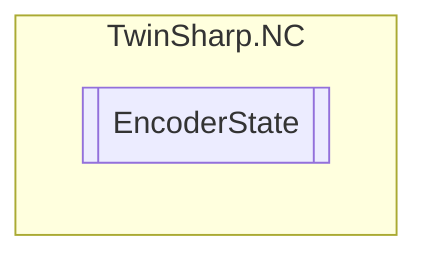

# EncoderState `Public class`

## Diagram


## Members
### Properties
#### Public  properties
| Type | Name | Methods |
| --- | --- | --- |
| `double` | [`ActualAcceleration`](#actualacceleration) | `get` |
| `double` | [`ActualDriveVelocity`](#actualdrivevelocity)<br>Optional: actual drive velocity(transferred directly from SoE, CoE or MDP 742 drive)<br>            Base Unit / s<br>            New from TC3.1 B4020.30 | `get` |
| `int` | [`ActualIncrements`](#actualincrements) | `get` |
| `int` | [`ActualModuloRotation`](#actualmodulorotation) | `get` |
| `double` | [`ActualPosition`](#actualposition) | `get` |
| `double` | [`ActualPositionCorrectionValue`](#actualpositioncorrectionvalue)<br>Measuring system error correction | `get` |
| `double` | [`ActualPositionDueToDeadTimeCompensation`](#actualpositionduetodeadtimecompensation) | `get` |
| `double` | [`ActualPositionFiltered`](#actualpositionfiltered)<br>Filtered actual position (offset with actual position correction value, without dead time compensation) | `get` |
| `double` | [`ActualPositionModulo`](#actualpositionmodulo) | `get` |
| `double` | [`ActualPositionUnfiltered`](#actualpositionunfiltered)<br>Charge with actual position compensation value. | `get` |
| `double` | [`ActualPositionWithoutCompensation`](#actualpositionwithoutcompensation) | `get` |
| `double` | [`ActualVelocity`](#actualvelocity) | `get` |
| `double` | [`ActualVelocityUnfiltered`](#actualvelocityunfiltered)<br>Optional: Unfiltered actual velocity<br>            Base Unit / s | `get` |
| `uint` | [`ErrorCode`](#errorcode) | `get` |
| `bool` | [`ReferenceFlag`](#referenceflag)<br>"Calibrate flag" | `get, set` |
| `int` | [`SoftwareActualIncrements`](#softwareactualincrements) | `get` |
| `double` | [`TimeShiftSumDueToDeadTimeCompensation`](#timeshiftsumduetodeadtimecompensation)<br>Sum of time shift for encoder dead time (parameterized and variable dead time).<br>            Note: A dead time is specified in the system as a positive value. | `get` |

### Methods
#### Public  methods
| Returns | Name |
| --- | --- |
| `void` | [`ReadActualPositionBuffer`](#readactualpositionbuffer)(out `double` position, out `double` time) |

## Details
### Constructors
#### EncoderState
[*Source code*](https://github.com///blob//TwinSharp/NC/EncoderState.cs#L9)
```csharp
internal EncoderState(AdsClient client, uint id)
```
##### Arguments
| Type | Name | Description |
| --- | --- | --- |
| `AdsClient` | client |   |
| `uint` | id |   |

### Methods
#### ReadActualPositionBuffer
[*Source code*](https://github.com///blob//TwinSharp/NC/EncoderState.cs#L140)
```csharp
public void ReadActualPositionBuffer(out double position, out double time)
```
##### Arguments
| Type | Name | Description |
| --- | --- | --- |
| `out` `double` | position |   |
| `out` `double` | time |   |

### Properties
#### ErrorCode
```csharp
public uint ErrorCode { get; }
```

#### ActualPosition
```csharp
public double ActualPosition { get; }
```

#### ActualPositionModulo
```csharp
public double ActualPositionModulo { get; }
```

#### ActualModuloRotation
```csharp
public int ActualModuloRotation { get; }
```

#### ActualVelocity
```csharp
public double ActualVelocity { get; }
```

#### ActualAcceleration
```csharp
public double ActualAcceleration { get; }
```

#### ActualIncrements
```csharp
public int ActualIncrements { get; }
```

#### SoftwareActualIncrements
```csharp
public int SoftwareActualIncrements { get; }
```

#### ReferenceFlag
```csharp
public bool ReferenceFlag { get; set; }
```
##### Summary
"Calibrate flag"

#### ActualPositionCorrectionValue
```csharp
public double ActualPositionCorrectionValue { get; }
```
##### Summary
Measuring system error correction

#### ActualPositionWithoutCompensation
```csharp
public double ActualPositionWithoutCompensation { get; }
```

#### ActualPositionDueToDeadTimeCompensation
```csharp
public double ActualPositionDueToDeadTimeCompensation { get; }
```

#### TimeShiftSumDueToDeadTimeCompensation
```csharp
public double TimeShiftSumDueToDeadTimeCompensation { get; }
```
##### Summary
Sum of time shift for encoder dead time (parameterized and variable dead time).
            Note: A dead time is specified in the system as a positive value.

#### ActualPositionUnfiltered
```csharp
public double ActualPositionUnfiltered { get; }
```
##### Summary
Charge with actual position compensation value.

#### ActualPositionFiltered
```csharp
public double ActualPositionFiltered { get; }
```
##### Summary
Filtered actual position (offset with actual position correction value, without dead time compensation)

#### ActualDriveVelocity
```csharp
public double ActualDriveVelocity { get; }
```
##### Summary
Optional: actual drive velocity(transferred directly from SoE, CoE or MDP 742 drive)
            Base Unit / s
            New from TC3.1 B4020.30

#### ActualVelocityUnfiltered
```csharp
public double ActualVelocityUnfiltered { get; }
```
##### Summary
Optional: Unfiltered actual velocity
            Base Unit / s

*Generated with* [*ModularDoc*](https://github.com/hailstorm75/ModularDoc)
