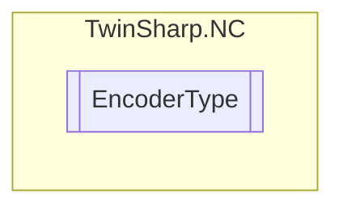

# EncoderType `Public enum`

## Diagram

## Details
### Fields
#### NOT_DEFINED

#### Simulation

#### ABS_M3000

#### INC_M31X0

#### INC_KL5101

#### ABS_KL5001_SSI

#### INC_KL5051

#### ABS_KL30XX

#### INC_Sercos_P

#### INC_Sercos_PV

#### INC_Binary

#### ABS_M2510

#### ABS_FOX50

#### HYDRAULIC_FORCE

#### AX2000_B200

#### PROFIDRIVE

#### UNIVERSAL

#### NCBACKPLANE

#### CANOPEN_LENZE

#### CANOPEN_DS402_MDP513_MDP742

#### AX2000_B900

#### KL5151

#### IP5209

#### KL2531_Stepper

#### KL2532_DC

#### TIMEBASEGENERATOR

#### INC_TCOM

#### CANOPEN_MDP513_64BIT

#### SPECIFIC

*Generated with* [*ModularDoc*](https://github.com/hailstorm75/ModularDoc)
