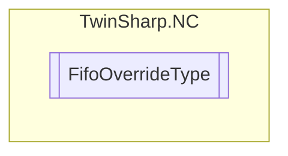

# FifoOverrideType `Public enum`

## Diagram

## Details
### Fields
#### OVERRIDETYPE_INSTANTANEOUS

#### OVERRIDETYPE_PT2

*Generated with* [*ModularDoc*](https://github.com/hailstorm75/ModularDoc)
