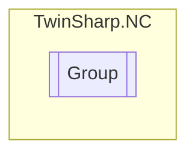

# Group `Public class`

## Description
Represents a group in the TwinCAT NC system.

## Diagram


## Members
### Properties
#### Public  properties
| Type | Name | Methods |
| --- | --- | --- |
| [`GroupFunctions`](./GroupFunctions.md) | [`Functions`](#functions)<br>Gets the functions of the group. | `get, private set` |
| [`GroupParameters`](./GroupParameters.md) | [`Parameters`](#parameters)<br>Gets the parameters of the group. | `get, private set` |
| [`GroupState`](./GroupState.md) | [`State`](#state)<br>Gets the state of the group. | `get, private set` |

## Details
### Summary
Represents a group in the TwinCAT NC system.

### Constructors
#### Group
[*Source code*](https://github.com///blob//TwinSharp/NC/Group.cs#L15)
```csharp
public Group(AdsClient client, uint id)
```
##### Arguments
| Type | Name | Description |
| --- | --- | --- |
| `AdsClient` | client | The ADS client. |
| `uint` | id | The group ID. |

##### Summary
Initializes a new instance of the [Group](twinsharp/nc/Group.md) class.

### Properties
#### Parameters
```csharp
public GroupParameters Parameters { get; private set; }
```
##### Summary
Gets the parameters of the group.

#### State
```csharp
public GroupState State { get; private set; }
```
##### Summary
Gets the state of the group.

#### Functions
```csharp
public GroupFunctions Functions { get; private set; }
```
##### Summary
Gets the functions of the group.

*Generated with* [*ModularDoc*](https://github.com/hailstorm75/ModularDoc)
