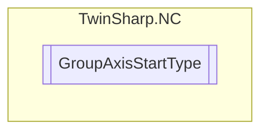

# GroupAxisStartType `Public enum`

## Diagram

## Details
### Fields
#### NOT_DEFINED

#### AbsoluteStart

#### RelativeStart

#### ContinousStartPositive

#### ContinousStartNegative

#### ModuloStartOLD

#### ModuloStartShortestDistance

#### JogPositiveSlow

#### JogNegativeSlow

#### ModuloStartPositiveDirection

#### JogPositiveFast

#### JogNegativeFast

#### ModuloStartNegativeDirection

#### StopAndLock

#### Halt

*Generated with* [*ModularDoc*](https://github.com/hailstorm75/ModularDoc)
